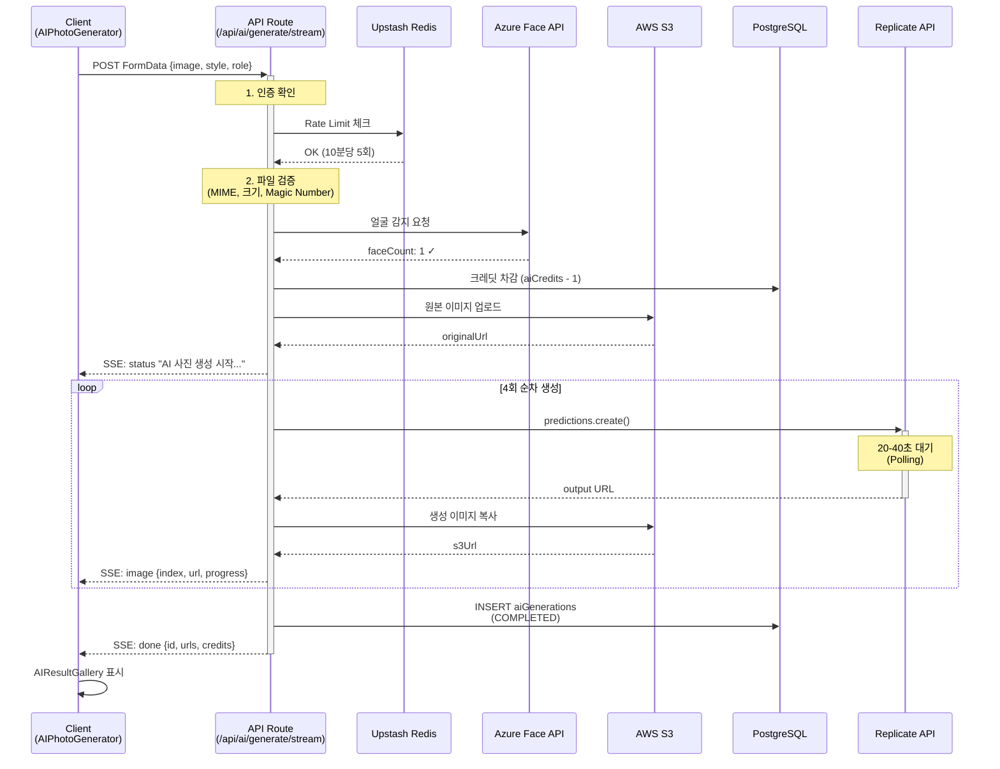
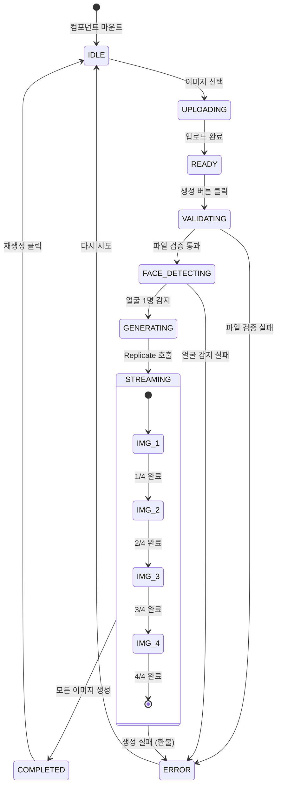
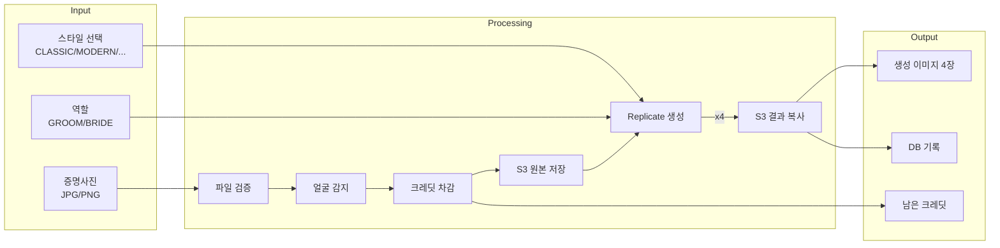
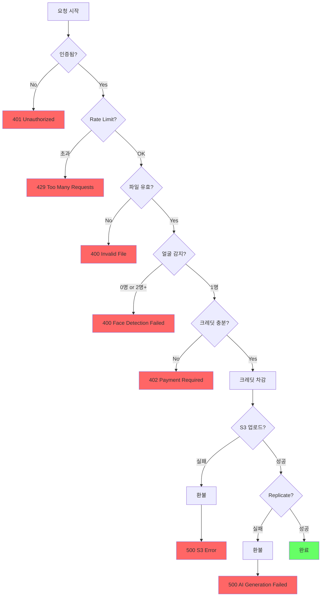

# AI 이미지 생성 프로세스

> 작성일: 2026-02-05

## 전체 흐름 (Sequence Diagram)



## 컴포넌트 구조

```mermaid
flowchart TB
    subgraph Client ["클라이언트"]
        A[AIPhotoSection.tsx] --> B[AIPhotoGenerator.tsx]
        B --> |생성 완료| C[AIResultGallery.tsx]
        C --> |선택| D[갤러리에 추가]
    end

    subgraph API ["API Routes"]
        E[/api/ai/generate/stream]
        F[/api/user/credits]
        G[/api/ai/generations]
    end

    subgraph Core ["Core Libraries"]
        H[lib/ai/replicate.ts]
        I[lib/ai/credits.ts]
        J[lib/ai/s3.ts]
        K[lib/ai/face-detection.ts]
    end

    subgraph External ["External Services"]
        L[(PostgreSQL)]
        M[(Redis)]
        N[Replicate API]
        O[Azure Face API]
        P[AWS S3]
    end

    B --> |POST| E
    A --> |GET| F
    E --> H
    E --> I
    E --> J
    E --> K

    H --> N
    I --> L
    J --> P
    K --> O
    E --> M
```

## 상태 전이



## 데이터 흐름



## 에러 처리 플로우



## S3 저장 구조

```
cuugu-ai-photos/ (S3 버킷)
├── ai-originals/
│   └── {userId}/          # 원본 이미지
│       └── {cuid2}.jpg
├── ai-generated/
│   └── {userId}/          # AI 생성 결과
│       └── {cuid2}.png
└── gallery/
    └── {userId}/          # 갤러리 직접 업로드
        └── {cuid2}.webp
```

## 핵심 파일

| 레이어 | 파일 | 역할 |
|--------|------|------|
| **컴포넌트** | `components/editor/tabs/gallery/AIPhotoSection.tsx` | 갤러리 AI 섹션 진입점 |
| | `components/editor/tabs/gallery/AIPhotoGenerator.tsx` | 생성 UI + SSE 처리 |
| | `components/editor/tabs/gallery/AIResultGallery.tsx` | 결과 선택 UI |
| **API** | `app/api/ai/generate/stream/route.ts` | SSE 스트리밍 엔드포인트 |
| | `app/api/user/credits/route.ts` | 크레딧 조회 |
| **라이브러리** | `lib/ai/replicate.ts` | Replicate API 호출 |
| | `lib/ai/models.ts` | AI 모델 정의 |
| | `lib/ai/credits.ts` | 크레딧 관리 |
| | `lib/ai/s3.ts` | S3 업로드/복사 |
| | `lib/ai/face-detection.ts` | Azure Face API |
| **스키마** | `db/schema.ts` | aiGenerations 테이블 |

## 주요 설정값

```typescript
// lib/ai/config.ts
AI_CONFIG = {
  MAX_FILE_SIZE: 10MB,
  BATCH_SIZE: 4,              // 한 번에 4장 생성
  RATE_LIMIT_REQUESTS: 5,     // 10분당 5회
  RATE_LIMIT_WINDOW: 600,     // 10분
}

// 모델별 비용 (USD)
FLUX_PRO:    $0.04/img  → 4장 = $0.16
FLUX_DEV:    $0.025/img → 4장 = $0.10
PHOTOMAKER:  $0.0095/img → 4장 = $0.038
```

## 요약

| 항목 | 내용 |
|------|------|
| **호출 방식** | SSE 스트리밍 (실시간 진행상황) |
| **Replicate 방식** | Polling (replicate.wait) - 동기 대기 |
| **생성 순서** | 순차 (병렬 불가) |
| **총 처리 시간** | 80-160초 (4장) |
| **저장소** | S3 + CloudFront |
| **크레딧** | 1 생성 = 1 크레딧 |
| **Rate Limit** | 10분당 5회 (Redis) |
