# AI 청첩장 테마 생성 시스템 — 품질 개선 기획서

> Cuggu AI Theme Generation Quality Improvement Plan
> 작성일: 2026-02-11

---

## 1. 개요

### 1-1. 현재 상태

사용자가 프롬프트를 입력하면 LLM이 `SerializableTheme` JSON을 생성하고,
`BaseTemplate`이 렌더링하는 구조. 3개 LLM 프로바이더(Claude Sonnet, GPT-4o, Gemini Flash) 지원.

### 1-2. 문제

- 생성된 테마가 **딱딱하고 촌스럽다**
- 경쟁사(바른청첩장, 보이스카드 등)는 눈발/꽃잎 날림, 화면 전환, 섬세한 애니메이션이 있는데 우리는 없다
- 동일 프롬프트로 여러 번 생성해도 **색상만 바뀌고 구조는 동일**
- 프롬프트 문제인지, 시스템 구조 문제인지 불분명

### 1-3. 분석 팀 구성

| 역할 | 분석 영역 |
|------|----------|
| 개발자 | 템플릿 아키텍처, 컴포넌트 제약, 구현 가능성 |
| 디자이너 | 색상 이론, 타이포그래피, 시각 품질 기준 |
| 기획자 | 근본 원인 진단, 우선순위, 경쟁 분석 |
| 프롬프트 엔지니어 1 | 시스템 프롬프트 구조 분석 + 리뉴얼 |
| 프롬프트 엔지니어 2 | 경쟁사 리서치 + 2026 트렌드 |
| 프롬프트 엔지니어 3 | 코드 기반 분석 + 레이아웃 시드 설계 |

---

## 2. 근본 원인 진단

### 2-1. 영향도 매트릭스

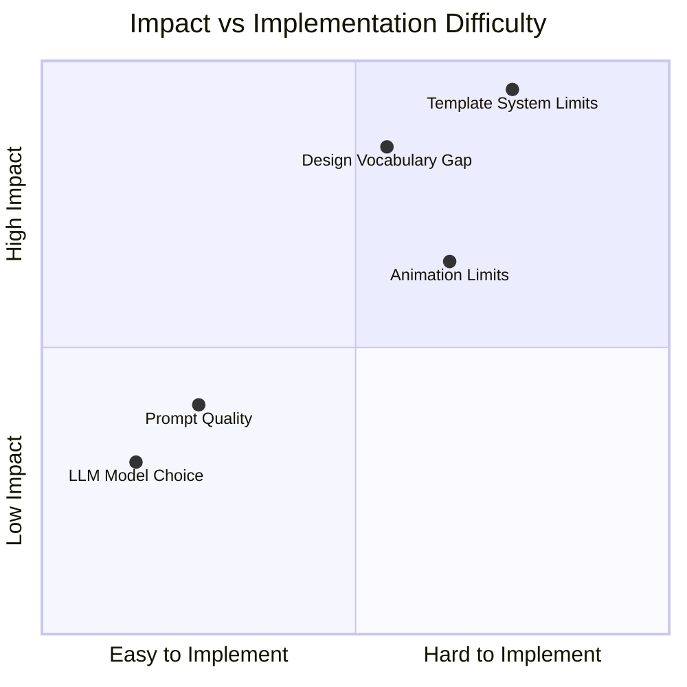

### 2-2. 원인-결과 분석 (Ishikawa)

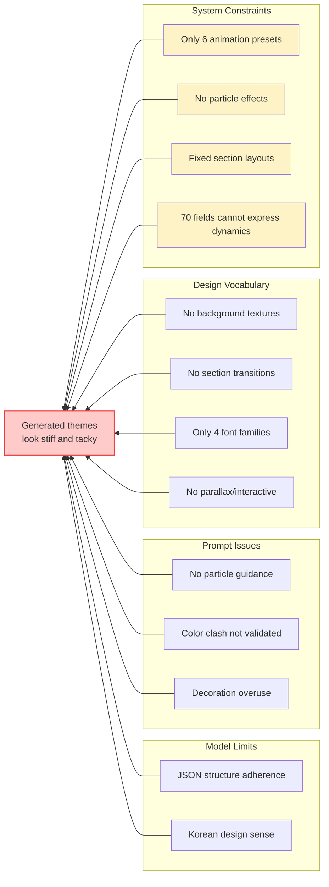

### 2-3. 원인 상세

| 순위 | 원인 | 영향도 | 설명 |
|------|------|--------|------|
| 1 | **템플릿 시스템 제약** | 9/10 | SerializableTheme이 제어할 수 있는 표현 범위 자체가 좁음 |
| 2 | **디자인 어휘 부족** | 8/10 | 파티클, 패럴랙스, 섹션 전환, 배경 텍스처 등 시각 요소 없음 |
| 3 | **애니메이션 제한** | 6/10 | 6개 프리셋만 존재. 눈/꽃잎/반짝임 등 환경 효과 불가 |
| 4 | **프롬프트 품질** | 4/10 | v2로 개선됨. 추가 개선 여지 있으나 시스템 제약이 더 큼 |
| 5 | **LLM 모델 선택** | 3/10 | Claude Sonnet이 가장 안정적. 모델 변경으로 큰 차이 없음 |

### 2-4. 핵심 통찰

> **프롬프트를 아무리 잘 써도, 시스템이 표현할 수 없는 건 생성되지 않는다.**
>
> AI가 "벚꽃이 날리는 로맨틱한 청첩장"을 이해해도,
> SerializableTheme에 파티클 필드가 없으면 출력할 수 없다.

---

## 3. 현재 아키텍처 분석

### 3-1. 데이터 흐름

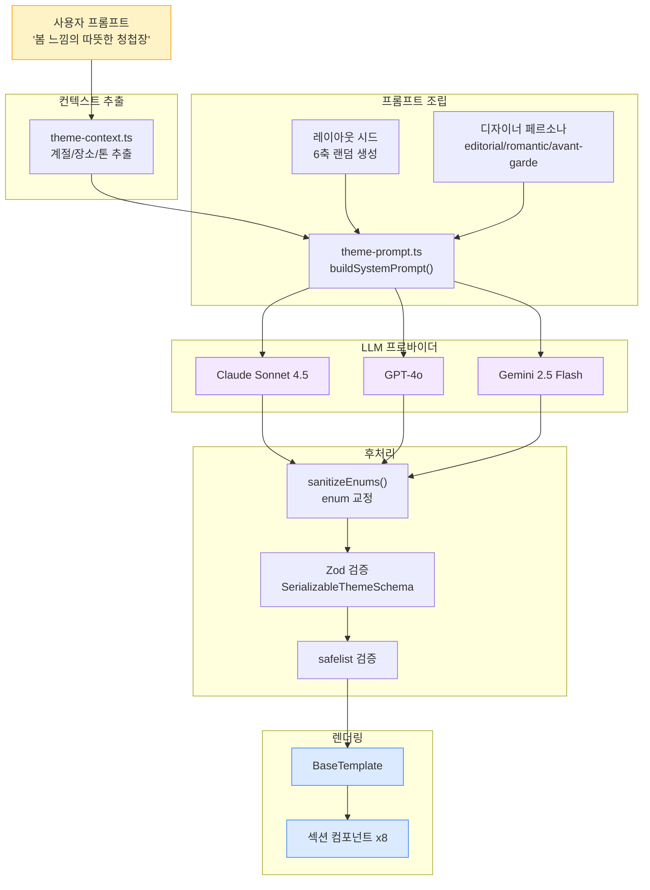

### 3-2. 파일 구조

```
lib/ai/
├── theme-prompt.ts          # 시스템 프롬프트 v2 (블록 기반)
├── theme-generation.ts      # generateTheme() 메인 함수
├── theme-context.ts         # 청첩장 데이터 → 컨텍스트 추출
├── theme-models.ts          # LLM 모델 레지스트리 (3개)
└── theme-providers/
    ├── types.ts             # ThemeGenerationProvider 인터페이스
    ├── index.ts             # 프로바이더 라우터
    ├── anthropic.ts         # Claude (tool_use)
    ├── openai.ts            # GPT-4o (function calling)
    └── gemini.ts            # Gemini Flash (functionDeclarations)

lib/templates/
├── types.ts                 # SerializableTheme 인터페이스 (~70필드)
├── themes.ts                # 빌트인 6테마 (classic/modern/minimal/floral/elegant/natural)
├── safelist.ts              # Tailwind safelist (빌트인 + 확장 ~726개)
└── resolvers.ts             # AnimationPreset → Framer Motion props

components/templates/
├── BaseTemplate.tsx         # 섹션 오케스트레이터
├── CoverSection.tsx         # 커버
├── FooterSection.tsx        # 푸터
├── renderers/               # HeadingRenderer, DividerRenderer, DecorationRenderer
└── sections/
    ├── GreetingSection.tsx   # 인사말
    ├── ParentsSection.tsx    # 부모님
    ├── CeremonySection.tsx   # 예식 정보
    ├── GallerySection.tsx    # 갤러리
    ├── MapInfoSection.tsx    # 지도
    ├── AccountsSection.tsx   # 계좌
    ├── RsvpSectionWrapper.tsx # RSVP
    └── DDayWidget.tsx        # D-Day 캘린더
```

### 3-3. 표현력 제약 맵

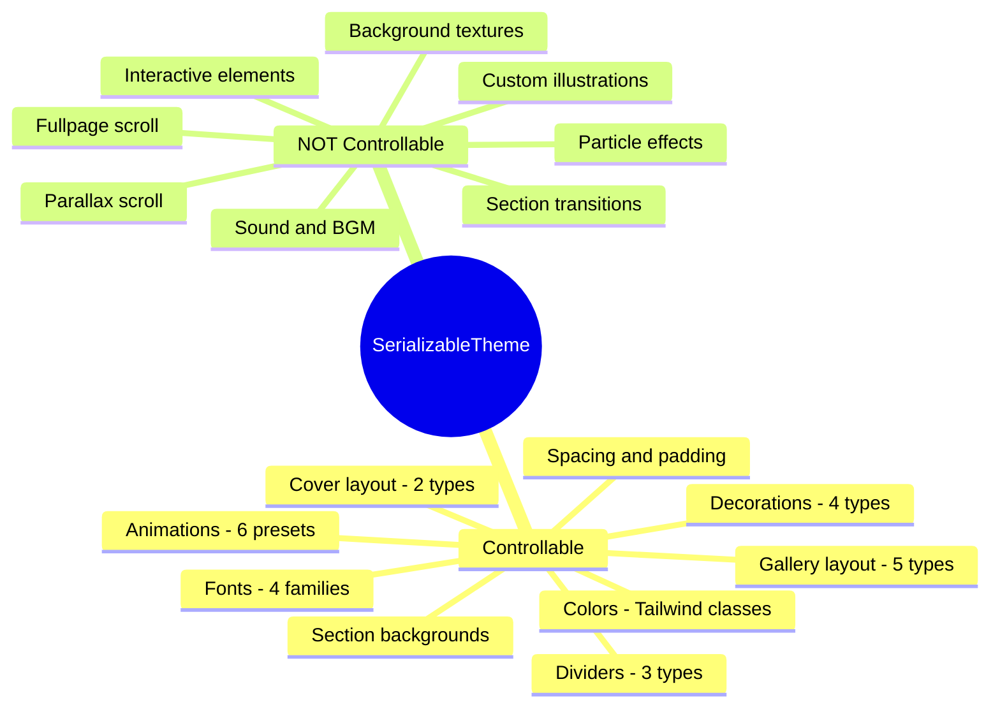

---

## 4. 경쟁사 분석

### 4-1. 주요 경쟁사 비교

| 기능 | Cuggu (현재) | 바른청첩장 | 보이스카드 | 데어무드 | 보자기카드 |
|------|-------------|-----------|-----------|---------|-----------|
| 파티클 효과 | ❌ | ✅ 눈/꽃잎 | ✅ 다양 | ✅ | ✅ |
| 페이지 전환 | ❌ | ✅ 스와이프 | ✅ 페이드 | ❌ | ✅ |
| 배경 동영상 | ❌ | ✅ | ❌ | ❌ | ❌ |
| 커버 애니메이션 | 기본 slide | 풍부 | 풍부 | 기본 | 풍부 |
| 타이포그래피 | 4종 | 20+ | 10+ | 15+ | 10+ |
| 색상 커스텀 | Tailwind | 자유 팔레트 | 자유 팔레트 | 프리셋 | 자유 |
| AI 생성 | ✅ | ❌ | ❌ | ❌ | ❌ |

### 4-2. 기능 격차 시각화

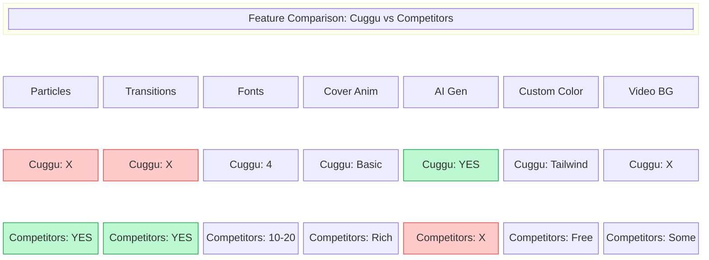

### 4-3. 경쟁사 우위 요소 (포지셔닝)

**우리만의 강점**: AI 생성 (프롬프트 → 즉시 테마). 경쟁사는 전부 수동 템플릿.

**경쟁사 우위**: 시각적 화려함. 특히 파티클, 전환 효과, 다양한 폰트가 "프리미엄 느낌"을 좌우.

### 4-4. 2026 한국 모바일 청첩장 디자인 트렌드

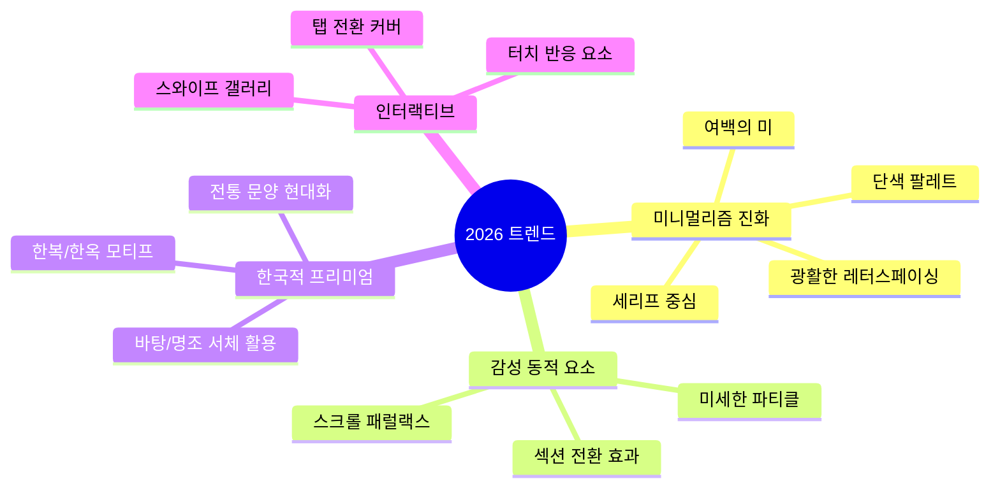

---

## 5. 개선 전략

### 5-1. 전체 로드맵

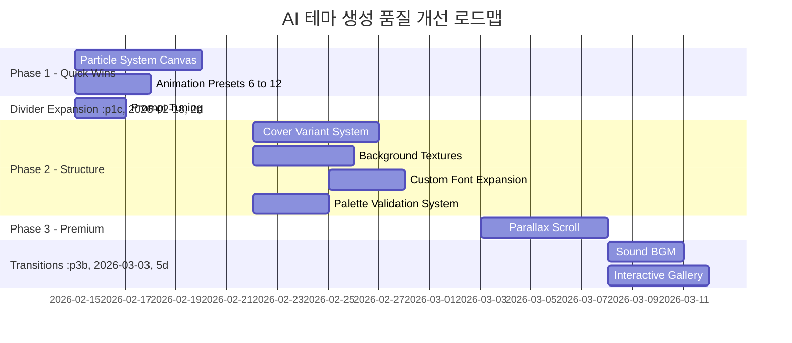

### 5-2. Phase 1: 빠른 승리 (Quick Wins)

> 기존 구조 내에서 최소 변경으로 최대 효과

#### 5-2-1. 파티클 시스템 (Canvas)

경쟁사 대비 가장 큰 시각적 격차. Canvas 기반 GPU 가속 파티클.

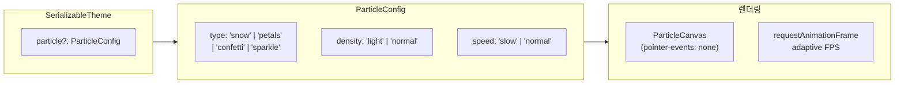

**ParticleConfig 스키마**:

```typescript
interface ParticleConfig {
  type: 'snow' | 'petals' | 'confetti' | 'sparkle' | 'firefly';
  density: 'light' | 'normal' | 'dense';
  speed: 'slow' | 'normal' | 'fast';
  color?: string;         // Tailwind 색상명 (e.g., 'rose-300')
  opacity?: number;       // 0.1 ~ 0.8
  zIndex?: 'behind' | 'front';  // 콘텐츠 뒤/앞
}
```

**파티클 라이프사이클**:

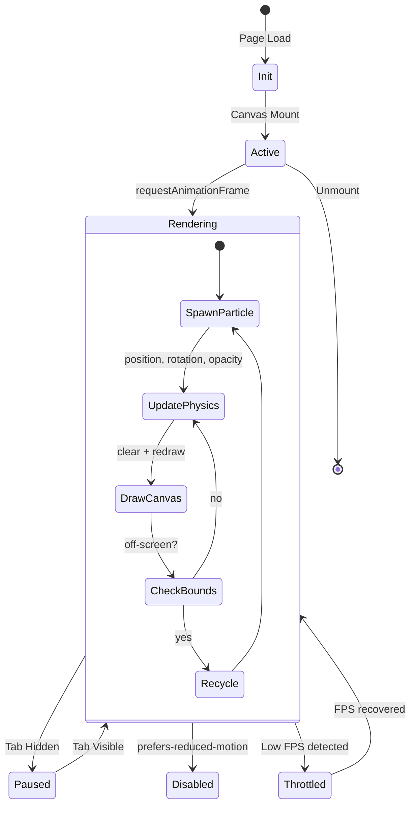

**구현 핵심**:
- `<canvas>` 절대 위치, `pointer-events: none` → 터치/클릭 방해 없음
- `requestAnimationFrame` + visibility API → 탭 비활성 시 정지
- 모바일: `devicePixelRatio` 기반 밀도 자동 조절, 저사양 기기 감지 시 비활성화
- 파티클 타입별 물리 시뮬레이션:

| 타입 | 동작 | 적합한 테마 |
|------|------|-----------|
| `snow` | 느린 하강 + 좌우 흔들림 | 겨울, 크리스마스 |
| `petals` | 곡선 낙하 + 회전 | 봄, 로맨틱, 플로럴 |
| `confetti` | 빠른 낙하 + 다색 + 회전 | 축하, 파티 |
| `sparkle` | 랜덤 위치 깜빡임 | 야간, 우아함 |
| `firefly` | 느린 부유 + 발광 | 자연, 가든 |

#### 5-2-2. 애니메이션 프리셋 확장 (6 → 12)

현재 6개 → 12개로 확장:

| 기존 | 추가 |
|------|------|
| `fade` | `blur-in` (블러에서 선명하게) |
| `slide-x-left` | `slide-x-left-fade` (슬라이드+페이드) |
| `slide-x-right` | `slide-x-right-fade` |
| `slide-y` | `slide-y-bounce` (바운스 이징) |
| `scale` | `rotate-in` (약간 회전하며 등장) |
| `fade-scale` | `reveal-up` (마스크 위로 열림) |

#### 5-2-3. 섹션 디바이더 확장

현재: `horizontal-line`, `vertical-line`, `gradient-line`, `none`

추가:
- `wave` — SVG 물결 선
- `dots` — 점 3~5개 (· · ·)
- `botanical` — 간단한 식물 SVG
- `double-line` — 이중 선

#### 5-2-4. 프롬프트 미세 조정

현재 v2 시스템 프롬프트 위에 추가 개선:

| 항목 | 현재 | 개선 |
|------|------|------|
| 파티클 가이드 | 없음 | 무드별 파티클 매핑 규칙 추가 |
| 새 애니메이션 | 6개만 안내 | 12개 프리셋 + 무드 매핑 |
| 색상 검증 | 규칙만 서술 | Bad/Good 예시 추가 |
| 디바이더 | 3타입 | 7타입 + 추천 조합 |

### 5-3. Phase 2: 구조 확장

#### 5-3-1. 커버 변형 시스템

현재: `center`, `bottom-left` 2종

확장:
- `split` — 이미지 좌/텍스트 우 (또는 반대)
- `fullscreen-text` — 이미지 없이 타이포 중심
- `minimal-bar` — 상단 얇은 바에 이름, 하단에 이미지
- `card-overlay` — 카드형 반투명 오버레이

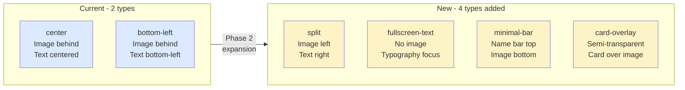

#### 5-3-2. 배경 텍스처/패턴

```typescript
interface BackgroundTexture {
  type: 'grain' | 'linen' | 'paper' | 'watercolor' | 'none';
  opacity: number;    // 0.02 ~ 0.15 (매우 미세하게)
  blend: 'multiply' | 'overlay' | 'soft-light';
}
```

CSS `background-image` + `mix-blend-mode`로 구현. 미세한 텍스처가 "인쇄물 같은 질감" 부여.

#### 5-3-3. 커스텀 폰트 확장

현재 4종 → 8~10종:

| 현재 | 추가 후보 |
|------|----------|
| font-sans (고딕) | 본고딕 (Noto Sans KR) |
| font-serif (명조) | 나눔스퀘어 라운드 |
| font-batang (바탕) | 마루 부리 |
| font-myeongjo (나눔명조) | 리디바탕 |
| | 코펍바탕 |
| | G마켓 산스 |

Google Fonts + `@next/font` 로 온디맨드 로딩.

#### 5-3-4. 색상 팔레트 검증 시스템

AI가 색상을 잘못 조합하는 문제 해결:

```typescript
function validatePalette(theme: SerializableTheme): PaletteIssue[] {
  // 1. 본문 텍스트 명도 >= 500 확인
  // 2. 배경-텍스트 대비율 WCAG AA (4.5:1) 검증
  // 3. 따뜻한 색+차가운 색 혼합 경고
  // 4. 동일 색상 family 3개 초과 경고
}
```

Zod 검증 이후, 렌더링 전에 팔레트 검증 → 자동 교정 or 재생성.

### 5-4. Phase 3: 프리미엄 차별화

#### 5-4-1. 패럴랙스 스크롤

커버 이미지에 `transform: translateY(scrollY * 0.3)` 적용. 5줄 코드로 구현 가능하나 모바일 성능 고려 필요.

#### 5-4-2. 섹션 전환 효과

```typescript
type SectionTransition = 'none' | 'fade-overlap' | 'slide-up' | 'curtain';
```

`IntersectionObserver` + CSS transform 기반. 섹션 간 전환이 "페이지 넘기는" 느낌.

#### 5-4-3. 인터랙티브 갤러리

현재 그리드 + 라이트박스 → 추가:
- 스와이프 캐러셀
- 3D 카드 플립
- 세로 스크롤 시네마틱

---

## 6. 프롬프트 시스템 현황 및 개선

### 6-1. v2 프롬프트 구조 (현재)

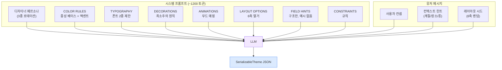

### 6-2. v2에서 이미 해결된 것

- ✅ 전체 JSON 예시 제거 (anchor bias 방지)
- ✅ 디자이너 페르소나 로테이션 (editorial / romantic / avant-garde)
- ✅ 레이아웃 시드 6축 랜덤 주입 (5×4×2×3×4×3 = 1,440 조합)
- ✅ 컨텍스트 기반 힌트 (계절 → 색감, 장소 → 격식도)
- ✅ enum 교정 시스템 (AI 출력 하이픈 오류 자동 수정)

### 6-3. 아직 부족한 것

| 문제 | 현상 | 원인 |
|------|------|------|
| 색상 충돌 | 따뜻한 accent + 차가운 accent 혼재 | 규칙만 있고 검증 없음 |
| 본문 가독성 | 채도 높은 색으로 body text 지정 | shade 규칙 위반 감지 없음 |
| 데코 과잉 | 모든 슬롯에 데코레이션 채움 | "40% none" 규칙 무시 |
| 타이포 단조 | heading/body 같은 폰트+같은 weight | weight 대비 강제 없음 |
| 파티클 부재 | 시스템이 지원하지 않음 | 스키마에 필드 없음 |

### 6-4. Phase 1 프롬프트 추가 블록

**파티클 매핑 블록** (Phase 1에서 ParticleConfig 추가 후):

```
## PARTICLES
Optional ambient particles that float over the entire page.
- Romantic/warm/floral: "petals" with density "light"
- Winter/night/elegant: "snow" with density "light"
- Celebration/festive: "confetti" with density "normal"
- Garden/nature/night: "firefly" with density "light"
- Minimal/editorial themes: DO NOT add particles (set to null)
- When in doubt, omit particles. Less is more.
```

**새 애니메이션 매핑** (확장 후):

```
## ANIMATIONS (updated)
12 presets available:
- Warm/romantic: "slide-y" or "fade-scale"
- Minimal/poetic: "fade" or "blur-in"
- Bold/modern: "slide-x-left-fade" / "slide-x-right-fade"
- Elegant/formal: "reveal-up"
- Playful: "slide-y-bounce" or "rotate-in"
```

---

## 7. 디자인 가이드라인

### 7-1. 한국 프리미엄 디자인 원칙

경쟁사 분석과 2026 트렌드에서 도출한 핵심 원칙:

| 원칙 | 설명 | 구현 |
|------|------|------|
| **여백 (Negative Space)** | 꽉 찬 것보다 비어 있는 것이 고급 | `sectionSpacing: 'spacious'`, 넉넉한 padding |
| **절제 (Restraint)** | 장식은 적게, 있다면 일관되게 | 데코 40% none 규칙, 이모지 1종 |
| **대비 (Contrast)** | 요소 간 확실한 위계 | heading ≥ 700, body 500-600, label 300-400 |
| **질감 (Texture)** | 평면이 아닌 종이/천 같은 느낌 | 배경 텍스처, 미세한 그라데이션 |
| **호흡 (Rhythm)** | 색 있는 섹션과 흰 섹션 교차 | sectionBg 2-3개만 |

### 7-2. 컬러 팔레트 프리셋 (디자이너 제안)

| 이름 | 중성 베이스 | 메인 액센트 | 서브 액센트 | 무드 |
|------|-----------|-----------|-----------|------|
| 새벽빛 | stone | rose-300 | amber-200 | 새벽 하늘의 분홍빛 |
| 한옥 달빛 | neutral | amber-600 | stone-700 | 전통 + 달빛 |
| 유리정원 | slate | emerald-400 | sky-200 | 투명한 온실 |
| 밤의 서약 | zinc-800+ | amber-400 | slate-300 | 어두운 럭셔리 |
| 물빛 | stone | sky-300 | emerald-200 | 맑은 물가 |
| 붉은 가을 | neutral | red-700 | amber-500 | 가을 단풍 |

### 7-3. 타이포그래피 페어링 규칙

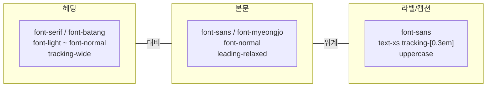

**핵심 규칙**:
- heading과 body는 **다른 폰트 패밀리** 사용 (같으면 단조로움)
- heading은 light weight + wide tracking → 고급스러움
- body는 normal weight + relaxed leading → 가독성
- 라벨은 극소 사이즈 + 극광 tracking → 공간감

---

## 8. 기술 구현 상세

### 8-1. 스키마 변경 (Phase 1)

**`lib/templates/types.ts`** — 추가 필드:

```typescript
// ── 파티클 ──
particle?: ParticleConfig | null;

// ── 배경 텍스처 ──
backgroundTexture?: BackgroundTexture | null;

// ── 추가 디바이더 타입 ──
// DividerConfig.type에 'wave' | 'dots' | 'botanical' | 'double-line' 추가
```

**`schemas/theme.ts`** — Zod 스키마 동기화.

### 8-2. ParticleCanvas 컴포넌트

**새 파일**: `components/templates/effects/ParticleCanvas.tsx`

```
BaseTemplate
  └── <div className={theme.containerBg} style={{ position: 'relative' }}>
        {theme.particle && <ParticleCanvas config={theme.particle} />}
        <CoverSection ... />
        {sections...}
        <FooterSection ... />
      </div>
```

**성능 고려사항**:
- Canvas 크기: `window.innerWidth × window.innerHeight` (뷰포트)
- 파티클 수: `density === 'light' ? 20 : density === 'normal' ? 40 : 60`
- FPS: `requestAnimationFrame` + 16ms 타겟 (60fps), 저사양 시 30fps로 자동 다운
- `document.hidden` 체크 → 탭 비활성 시 렌더링 중지
- `prefers-reduced-motion` 미디어 쿼리 존중 → 접근성

### 8-3. 애니메이션 확장

**`lib/templates/resolvers.ts`** — 새 프리셋 추가:

```typescript
const ANIMATION_PRESETS: Record<AnimationPreset, MotionVariants> = {
  // ... 기존 6개 ...
  'blur-in': {
    initial: { opacity: 0, filter: 'blur(10px)' },
    whileInView: { opacity: 1, filter: 'blur(0px)' },
  },
  'slide-x-left-fade': {
    initial: { opacity: 0, x: -30 },
    whileInView: { opacity: 1, x: 0 },
  },
  // ... etc
};
```

### 8-4. Safelist 확장

Phase 1에서 추가해야 할 클래스:

```
// 파티클 관련
pointer-events-none, fixed, inset-0

// 새 디바이더 SVG용
fill-current, stroke-current

// 텍스처용
mix-blend-multiply, mix-blend-overlay, mix-blend-soft-light
bg-[url(...)]
```

### 8-5. 컴포넌트 의존성 그래프

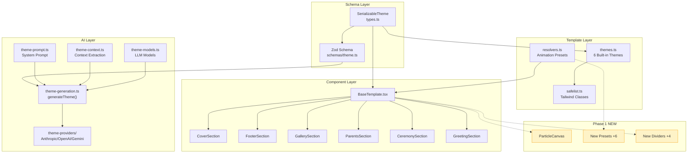

### 8-6. 수정 파일 요약

| Phase | 파일 | 변경 |
|-------|------|------|
| 1 | `lib/templates/types.ts` | ParticleConfig, BackgroundTexture 타입 추가 |
| 1 | `schemas/theme.ts` | particle, backgroundTexture Zod 스키마 |
| 1 | `components/templates/effects/ParticleCanvas.tsx` | **신규** — Canvas 파티클 |
| 1 | `components/templates/BaseTemplate.tsx` | ParticleCanvas 조건부 렌더링 |
| 1 | `lib/templates/resolvers.ts` | AnimationPreset 6개 추가 |
| 1 | `lib/templates/safelist.ts` | 신규 클래스 추가 |
| 1 | `components/templates/renderers/DividerRenderer.tsx` | wave, dots, botanical, double-line |
| 1 | `lib/ai/theme-prompt.ts` | 파티클/애니메이션/디바이더 블록 추가 |
| 2 | `components/templates/CoverSection.tsx` | split, fullscreen-text, minimal-bar, card-overlay |
| 2 | `lib/ai/theme-prompt.ts` | 커버 변형 가이드 추가 |
| 2 | `lib/ai/theme-generation.ts` | 팔레트 검증 로직 |
| 3 | `components/templates/effects/ParallaxCover.tsx` | **신규** — 패럴랙스 |
| 3 | `components/templates/effects/SectionTransition.tsx` | **신규** — 전환 효과 |

---

## 9. Before / After 비교

### 9-1. Before: 구조적 동일 (색상만 변경)

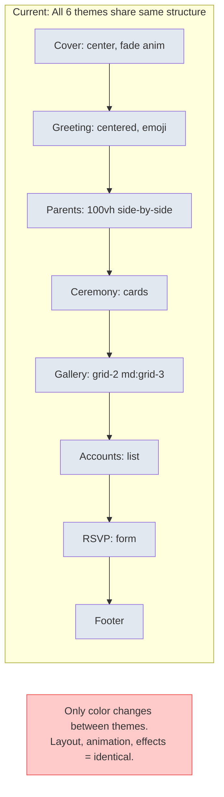

### 9-2. After: 구조적 다양성 (봄밤 벚꽃 테마 예시)

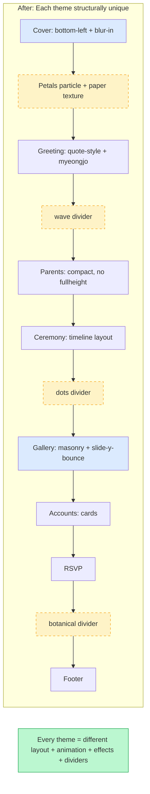

### 9-3. 시각 효과 대비

| 요소 | Before | After |
|------|--------|-------|
| 커버 진입 | 단순 slide-up | blur-in + 패럴랙스 + 파티클 |
| 섹션 전환 | 없음 (갑자기 다음 섹션) | fade-overlap or slide-up |
| 갤러리 | 정적 2열 그리드 | masonry + stagger 애니메이션 |
| 배경 | 평면 단색/그라데이션 | 텍스처 + 미세 그레인 |
| 환경 효과 | 없음 | 눈/꽃잎/반짝임 파티클 |
| 디바이더 | 직선 or 없음 | 물결/점/식물/이중선 |

### 9-4. 빌트인 6테마 구조 차별화 목표

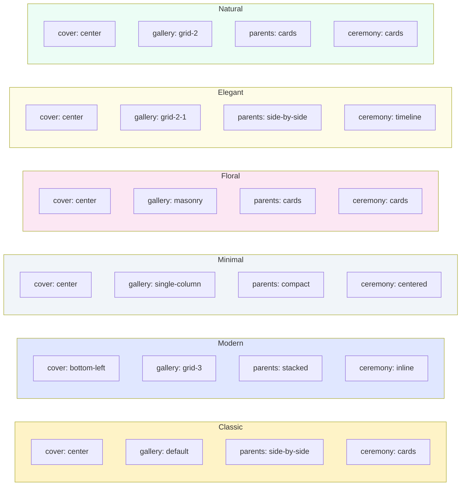

---

## 10. 검증 방법

### 10-0. 검증 프로세스 플로우

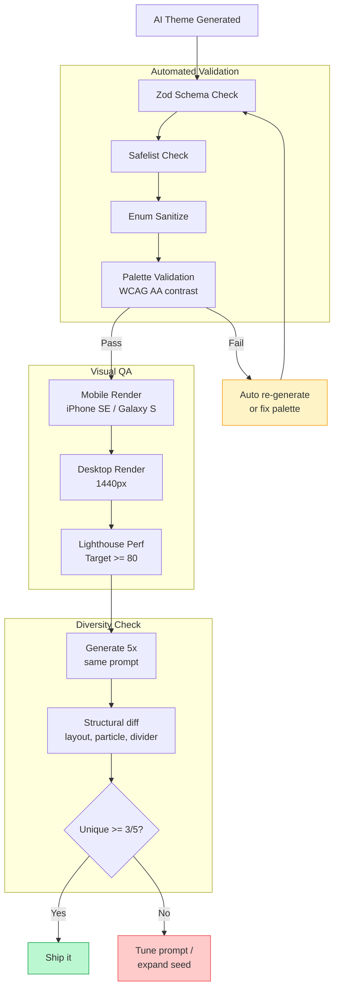

### 10-1. Phase 1 검증

- [ ] **파티클**: 5종(snow/petals/confetti/sparkle/firefly) 각각 렌더링 확인
- [ ] **성능**: 파티클 ON 상태에서 모바일 Chrome Lighthouse Performance ≥ 80
- [ ] **접근성**: `prefers-reduced-motion: reduce` 시 파티클 자동 비활성화
- [ ] **AI 생성 다양성**: 동일 프롬프트 5회 생성 → 구조+파티클+디바이더 차이 확인
- [ ] **하위호환**: 기존 6테마 + 기존 AI 생성 테마 정상 렌더링 (particle 없으면 무시)
- [ ] **Safelist**: 빌드 시 `safelist_failed` 미발생

### 10-2. Phase 2 검증

- [ ] **커버 변형**: 6종 레이아웃 각각 모바일/데스크톱 스크린샷
- [ ] **색상 검증**: WCAG AA 대비율 자동 체크 패스
- [ ] **폰트**: 추가 폰트 로딩 성능 (FOUT/CLS 측정)

### 10-3. Phase 3 검증

- [ ] **패럴랙스**: iOS Safari, Android Chrome, 삼성 인터넷 동작 확인
- [ ] **섹션 전환**: 스크롤 jank 없음 (60fps)

---

## 11. 비용 영향

테마 생성 비용은 LLM 토큰 기반. Phase 1에서 시스템 프롬프트에 파티클/애니메이션 블록 추가 시:

| 모델 | 현재 비용/생성 | Phase 1 후 (추정) | 변화 |
|------|--------------|-----------------|------|
| Gemini Flash | ~$0.0003 | ~$0.0004 | +33% (미미) |
| GPT-4o | ~$0.005 | ~$0.006 | +20% |
| Claude Sonnet | ~$0.01 | ~$0.012 | +20% |

프롬프트 토큰 증가분 ~200토큰 → 비용 영향 무시 가능.

---

## 12. 전체 시스템 목표 상태

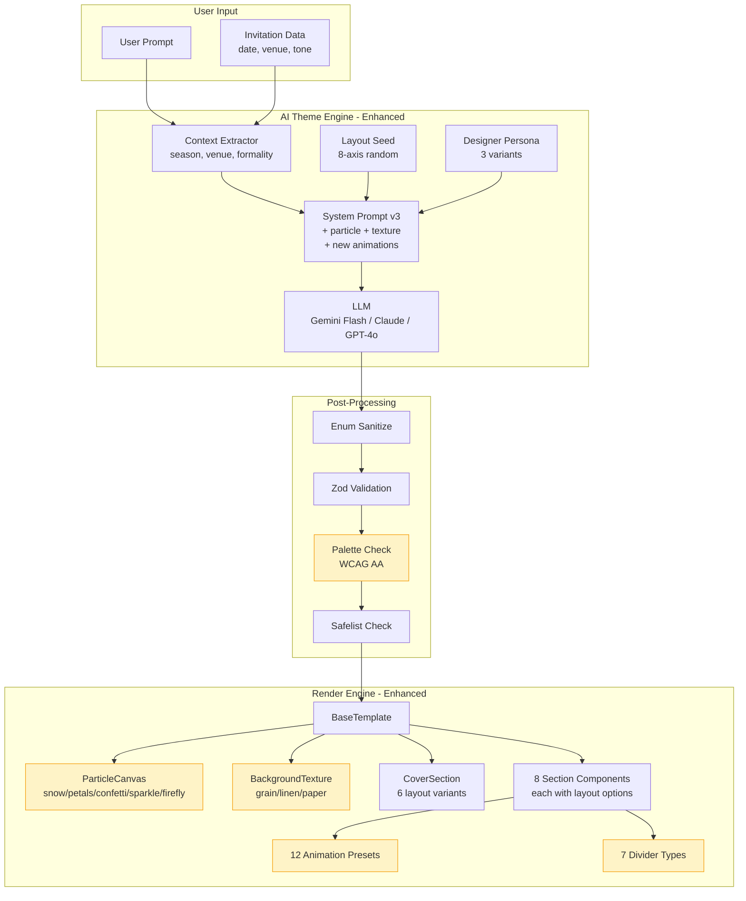

---

## 13. 열린 질문

1. **폰트 라이선스**: 추가 한글 폰트의 웹폰트 라이선스 확인 필요 (구글 폰트 vs 유료)
2. **파티클 모바일 배터리**: 저사양 기기에서 배터리 소모 이슈 → 자동 감지 임계값 설정 필요
3. **AI 생성 vs 프리셋**: 파티클을 AI가 선택하게 할지, 사용자가 직접 ON/OFF 할지
4. **배경 BGM**: 자동재생 정책(Chrome autoplay policy) 우회 방법 → 사용자 클릭 후 재생
5. **Phase 3 우선순위**: 패럴랙스 vs 섹션 전환 vs 인터랙티브 갤러리 중 뭘 먼저?

---

## 14. Phase 실행 의사결정

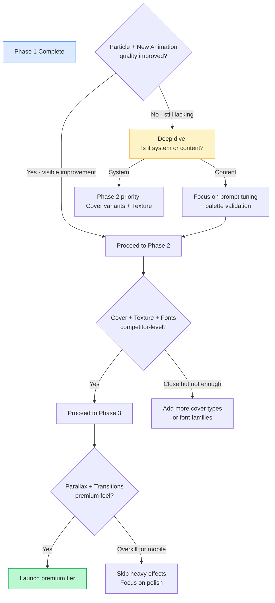

---

## 15. 결론

**문제의 본질은 프롬프트가 아니라 표현 시스템의 한계다.**

현재 SerializableTheme의 ~70개 필드는 "정적 웹 페이지의 스타일링"만 커버한다.
경쟁사가 제공하는 "감성적 동적 경험"(파티클, 전환, 패럴랙스)은 시스템이 지원하지 않아서 생성 자체가 불가능하다.

Phase 1 (파티클 + 애니메이션 확장 + 디바이더)만으로도 체감 품질이 크게 올라갈 것이며,
이후 Phase 2-3을 통해 경쟁사 수준 이상의 프리미엄 경험을 달성할 수 있다.

**핵심은 AI가 더 잘 쓰게 하는 것이 아니라, AI가 쓸 수 있는 도구를 넓혀주는 것이다.**
