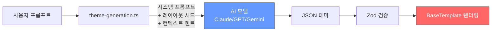
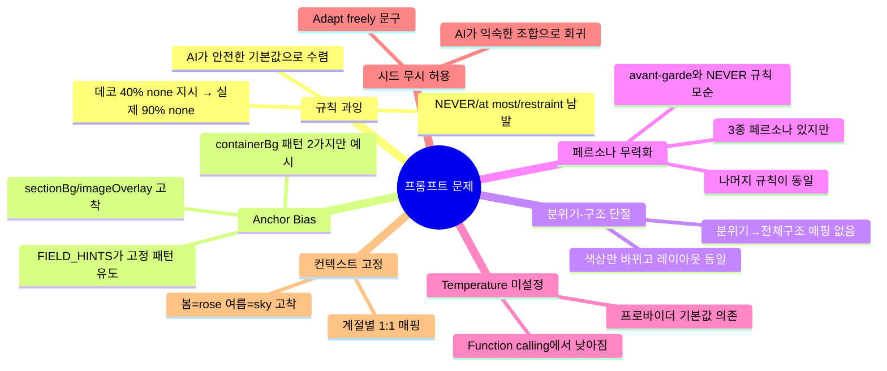
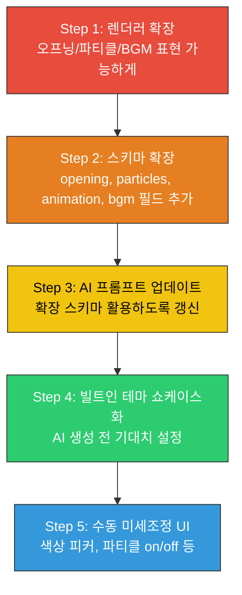
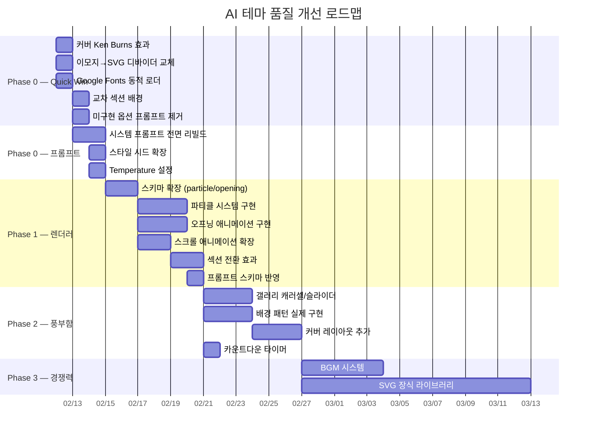
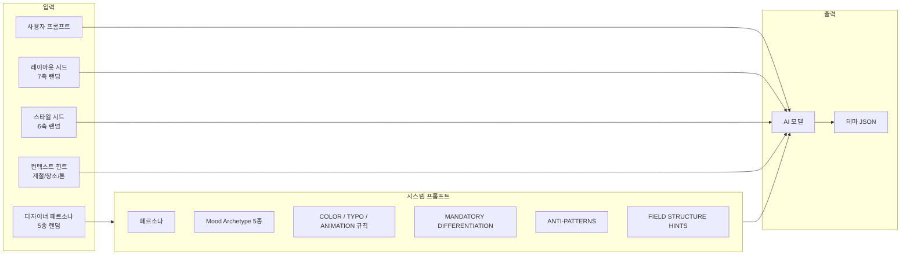
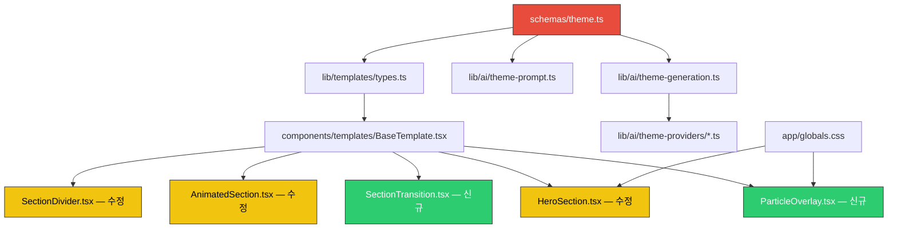
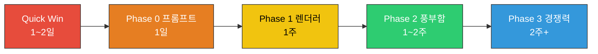

# AI 테마 생성 품질 분석 및 개선 전략

> 2026-02-11 | 6인 팀 분석 (개발자, 디자이너, 기획자, 프롬프트 엔지니어 x3)

---

## 1. 핵심 진단

**한 문장 요약**: 프롬프트를 아무리 개선해도 렌더러가 표현할 수 없는 건 나올 수 없다.

현재 시스템은 "색깔만 다른 같은 청첩장"을 생성한다. AI가 JSON 테마를 아무리 창의적으로 만들어도, BaseTemplate이 그릴 수 있는 시각적 요소가 색상 + 폰트 + 간격뿐이라 결과물이 수렴한다.

> "The theme system is a facade — it has the vocabulary of a rich design system but the rendering of a minimal one."
> — 디자이너 분석

### 현재 AI 테마 생성 파이프라인



**병목**: AI(C)가 아무리 창의적이어도 렌더러(F)가 표현할 수 있는 범위가 좁아 결과가 수렴.

---

## 2. 경쟁사 벤치마킹

### 2-1. 주요 경쟁사

| 서비스 | 특징 | 가격대 |
|--------|------|--------|
| **데어무드** | 오프닝 애니메이션 최강, 파티클 섹션별 ON/OFF, 인터뷰/화환/모청스냅 | 19,800원 |
| **바른손카드** | 200+ 템플릿, 인터랙티브 오프닝, 수채화/일러스트 배경 | 3~5만원 |
| **보헴** | 10+ 오프닝 스타일, 7종 파티클, 20+ BGM | 0~3만원 |
| **카드큐** | 40+ 템플릿, 파티클/BGM 유료 옵션 | 0~2만원 |
| **투아워게스트** | 인트로+레터링 위치 조정, 타임라인 섹션 | 만원대 |
| **봄카드** | 일러스트 특화, 무료 파티클/BGM | 0~2만원 |

### 2-2. 기능 갭 — 임팩트 × 난이도

```mermaid
quadrantChart
    title 기능 갭 — 임팩트 vs 구현 난이도
    x-axis 낮은 난이도 --> 높은 난이도
    y-axis 낮은 임팩트 --> 높은 임팩트
    quadrant-1 해야 하지만 오래 걸림
    quadrant-2 즉시 착수 (Quick Win)
    quadrant-3 나중에
    quadrant-4 필요하면
    오프닝 애니메이션: [0.55, 0.95]
    파티클 효과: [0.55, 0.92]
    BGM: [0.3, 0.7]
    Ken Burns 커버: [0.1, 0.85]
    이모지→SVG 교체: [0.25, 0.75]
    폰트 동적 로더: [0.2, 0.72]
    교차 섹션 배경: [0.08, 0.55]
    갤러리 다양화: [0.5, 0.6]
    스크롤 애니메이션 확장: [0.25, 0.55]
    SVG 장식 라이브러리: [0.75, 0.65]
    섹션 순서 변경: [0.5, 0.45]
    방명록: [0.55, 0.4]
    동영상 삽입: [0.6, 0.35]
    카운트다운 타이머: [0.15, 0.45]
```

### 2-3. 기능 갭 상세

| 기능 | 경쟁사 | Cuggu | 갭 |
|------|--------|-------|----|
| 오프닝 애니메이션 | 봉투열기, 타이핑, 커튼 등 5~10종 | **없음** | 치명적 |
| 파티클 효과 | 벚꽃/눈/하트/반짝이 7~12종 | **없음** | 치명적 |
| BGM | 20+ 내장곡, 커스텀 업로드 | **없음** | 높음 |
| 갤러리 다양성 | 슬라이더/콜라주/캐러셀 | 3열 그리드 고정 | 높음 |
| 배경 패턴/텍스처 | 수채화, 한지, 다마스크 등 | 스키마에만 존재, 렌더링 안 됨 | 높음 |
| SVG 장식 | 플로럴 프레임, 코너장식 등 | 이모지(🌸) 사용 | 높음 |
| 스크롤 애니메이션 | 풍부 (패럴랙스 포함) | fade-in 1종 | 중간 |
| 방명록 | 전원 제공 | 없음 | 중간 |
| 동영상 삽입 | 대부분 제공 | 없음 | 중간 |
| 섹션 순서 변경 | 일부 제공 | 없음 | 낮음 |

### 2-4. 시장 트렌드 (2024-2025)

- **오프닝 없으면 "싼티"** — 오프닝 페이지가 기본 기대치로 자리잡음
- **미니멀 + 포인트 장식** 조합이 대세 (과한 파티클 지양, 은은한 것 선호)
- **사진이 돋보이는 레이아웃** + **은은한 애니메이션**이 구매 결정 핵심
- **Pantone 2025**: Mocha Mousse — 깊이 있는 갈색, 따뜻함
- **인기 색상 조합**: sage green + gold, navy + blush, mocha + cream, dusty blue + white
- **Bold Minimalism**: 대담한 타이포 + 넉넉한 여백이 글로벌 트렌드

---

## 3. 렌더링 시스템 한계 (개발자 분석)

### 3-1. 현재 렌더러 능력 범위

```mermaid
flowchart TB
    subgraph 현재["현재 렌더러가 할 수 있는 것"]
        direction TB
        A1[8색 팔레트]
        A2[4종 폰트]
        A3[간격/패딩]
        A4[6종 스크롤 애니메이션]
        A5[2종 커버 레이아웃]
        A6[배경 패턴 — 부분 구현]
        A7[섹션별 색상 오버라이드]
    end

    subgraph 불가["렌더러가 할 수 없는 것"]
        direction TB
        style 불가 fill:#fee,stroke:#c33
        B1[파티클 효과]
        B2[오프닝 애니메이션]
        B3[BGM]
        B4[갤러리 캐러셀/슬라이더]
        B5[섹션 전환 효과]
        B6[일러스트/장식 프레임]
        B7[카운트다운 애니메이션]
        B8[동영상 삽입]
    end
```



### 3-2. 애니메이션 — 6개 프리셋뿐

| 프리셋 | 동작 |
|--------|------|
| fade | opacity 0→1 |
| slide-x-left | x:-20→0 + opacity |
| slide-x-right | x:20→0 + opacity |
| slide-y | y:20→0 + opacity |
| scale | scale:0.95→1 + opacity |
| fade-scale | scale:0.9→1 + opacity |

한계: 연속 루프 불가, 스크롤 패럴랙스 불가, 타이밍/이징 제어 없음(duration 0.6 하드코딩), `viewport={{ once: true }}`라 재생 안 됨.

### 3-3. 커버 — 단순 fade-out만

오프닝은 "텍스트 fade-in → 전체 fade-out"이 전부. 슬라이드, 줌, 커튼 등 오프닝 연출 없음. 오프닝 스타일을 테마에서 제어할 수 없음.

### 3-4. "유령 기능" (스키마에 선언, 렌더링 미구현)

| 선언된 기능 | 스키마 위치 | 렌더링 | 상태 |
|------------|-----------|--------|------|
| backgroundPattern: floral-watermark | decorationSettingsSchema | getPatternSvg()로 SVG 생성 | 부분 구현 |
| backgroundPattern: paper-texture | decorationSettingsSchema | feTurbulence SVG 필터 | 부분 구현 |
| borderStyle 전체 | decorationSettingsSchema | 없음 | **유령** |
| animate-fadeIn | effects.animation | @keyframes 미정의 | **유령** |

AI가 이런 값을 생성해도 화면에 반영 안 됨 → 사용자 신뢰 붕괴 위험.

---

## 4. 프롬프트 시스템 문제 (프롬프트 엔지니어 3명 종합)

### 4-1. 문제 요약



### 4-2. 상세

**규칙 과잉 → AI가 보수적으로 행동**: 프롬프트에 "NEVER", "at most", "restraint", "less is more" 같은 금지형 지시가 과도. LLM은 지시가 많을수록 가장 안전한 중간값(무채색, 기본 레이아웃, 데코 없음)으로 수렴.

- `DECORATION_RULES`의 "Use 'none' for at least 40%" → AI가 80~90%를 none으로 채움
- `CONSTRAINTS`의 "Omit optional fields you don't need" → AI가 대부분 생략
- `COLOR_RULES`의 "NEVER mix warm+cool accent" → avant-garde 페르소나와 모순

**Anchor bias**: v2에서 전체 JSON 예시를 제거했으나, `FIELD_HINTS`가 구체적 값 패턴을 제시하면서 사실상 anchor 역할. 예: `containerBg: "min-h-screen bg-gradient-to-b from-{X}-50 via-white to-{X}-50"` — 이 2가지 패턴만 예시 → AI가 거의 이 중 하나만 선택.

**분위기→구조 단절**: COLOR_RULES, TYPOGRAPHY_RULES, LAYOUT_OPTIONS가 각각 독립적. "따뜻한 분위기" → 색상만 바뀌고 레이아웃/모션/간격은 매번 동일.

**페르소나 효과 미미**: 3종 페르소나(editorial/romantic/avant-garde)의 프롬프트 본문은 다르지만, 규칙이 동일해서 실제 차이가 거의 없음.

**Temperature 미설정**: 세 프로바이더 모두 temperature 미설정. Function calling 모드에서 내부적으로 낮추는 프로바이더 있어 다양성 저하.

**레이아웃 시드 사실상 고정**: "Adapt freely" → AI가 시드를 힌트 정도로만 취급하고 익숙한 조합으로 회귀.

**컨텍스트 힌트 고정**: 봄=rose, 여름=sky, 가을=amber, 겨울=indigo로 고착. 비전형적 조합(봄 라벤더+연보라, 여름 산호+피치)이 불가.

---

## 5. 디자인 비평 (디자이너 분석)

### 5-1. 빌트인 테마 6개 비평

| 테마 | 핵심 문제 | 심각도 |
|------|----------|--------|
| **classic-romance** | DarkGoldenrod(#B8860B)는 "old web" 느낌. 프리미엄 골드는 #C4A265 계열. Great Vibes 남용. hero text-3xl 임팩트 부족. | 높음 |
| **modern-minimal** | Montserrat은 테크/스타트업 연상. surface(#1A1A1A)와 background(#0F0F0F) 거의 동일 → 섹션 구분 불가. | 높음 |
| **garden-botanical** | 6개 중 가장 조화로운 색상. 하지만 이름에 걸맞은 식물 일러스트 없음. | 중간 |
| **luxury-gold** | #0D1B2A 배경이 modern-minimal과 구분 안 됨. 다마스크 패턴 미구현. | 높음 |
| **soft-peach** | #E8967D가 탁함. 더 선명한 피치(#FFAA8C 계열)가 트렌드. | 중간 |
| **hanok-traditional** | 한지 질감이 SVG noise filter 수준이라 실감 부족. | 중간 |

### 5-2. 공통 문제

1. **이모지 디바이더** — OS마다 다르게 렌더링. 네이비 럭셔리 테마 사이에 분홍 장미 이모지는 부조화.
2. **시각적 레이어링 없음** — 모든 섹션이 text-center + padding 스택. z-depth, 장식 프레임 없음.
3. **동일한 섹션 구조** — 매 섹션이 "영문 라벨 → 콘텐츠 → 디바이더" 반복. 시각적 리듬 없음.
4. **폰트 로딩 미보장** — Google Fonts `<link>` 동적 주입이 없으면 시스템 폰트로 폴백. 타이포 차별화가 허구가 될 위험.

---

## 6. PM 전략 분석

### 6-1. 핵심 인사이트

> **"프롬프트 개선은 현재 구조에서 10~15% 개선이 한계."**
> 아름다움의 80%는 렌더러의 시각적 표현력(파티클, 애니메이션, 일러스트)에서 나온다.
> 스키마 확장이 선행되어야 AI가 더 풍부한 결과를 생성할 수 있다.

### 6-2. 실행 전략: 하이브리드 접근법



### 6-3. 가격 벤치마크

| 서비스 | 가격 | 핵심 유료 기능 |
|--------|------|---------------|
| 데어무드 | 19,800원 | 오프닝, 파티클, BGM, 인터뷰 |
| 바른손 | 3~5만원 | 200+ 템플릿, 인터랙티브 오프닝 |
| 보헴 | 0~3만원 | 파티클, BGM, 커스텀 오프닝 |
| 카드큐 | 0~2만원 | 파티클/BGM 유료 옵션 |

**PM 추천 모델**: 파티클 기본 3종 무료 → 프리미엄에서 전종 + 밀도 조절

### 6-4. 포지셔닝

> "AI가 만든 테마"가 아니라 **"AI가 당신의 취향에 맞춰 디자인합니다"**로 포지셔닝.
> AI 생성 후 수동 미세조정 UI가 필수 (색상 피커, 파티클 on/off 등).

---

## 7. 실행 로드맵

### 7-1. 전체 타임라인



### 7-2. Phase 0: Quick Win (1~2일)

| # | 항목 | 소요 | 파일 | 임팩트 |
|---|------|------|------|--------|
| 1 | **커버 Ken Burns 효과** — CSS 3줄로 배경사진에 느린 줌 애니메이션 | 30분 | HeroSection.tsx + globals.css | 극대 |
| 2 | **이모지 디바이더 → SVG 교체** — 커브/점/잎사귀 SVG, 테마 색상 반영 | 4시간 | SectionDivider.tsx | 높음 |
| 3 | **Google Fonts 동적 로더** — 테마 폰트에 맞는 `<link>` 자동 주입 | 3시간 | 신규 컴포넌트 + BaseTemplate | 높음 |
| 4 | **교차 섹션 배경** — 홀수/짝수 섹션에 surface 색상 교차 적용 | 1시간 | BaseTemplate.tsx | 중간 |
| 5 | **미구현 옵션 프롬프트에서 제거** — 유령 기능 차단 | 2시간 | theme-prompt.ts | 중간 |

### 7-3. Phase 0: 프롬프트 리빌드

| # | 변경 | 상세 |
|---|------|------|
| 1 | **금지형 → 목표형 전환** | "NEVER mix warm+cool" → "Choose colors that share warmth or coolness" |
| 2 | **Mood Archetype 5종 도입** | Cinematic / Poetic / Warm / Bold / Classic |
| 3 | **MANDATORY DIFFERENTIATION** | sectionBg 최소 1키, 커스텀 헤딩 2개+, 커버 데코 1개+ |
| 4 | **ANTI-PATTERNS 명시** | 전체 헤딩 동일 타입 금지, 전체 애니메이션 동일 프리셋 금지 |
| 5 | **레이아웃 시드 강제** | "Adapt freely" 제거 → "YOU MUST FOLLOW THIS" |
| 6 | **스타일 시드 확장** | headingStyle, decorationMode, dividerMode 등 6축 추가 |
| 7 | **Temperature 설정** | 각 프로바이더에 0.9~1.2 명시 |
| 8 | **컨텍스트 힌트 다양화** | 계절별 2~3가지 방향 제시 |
| 9 | **페르소나별 규칙 차별화** | avant-garde: warm+cool 믹스 허용, 데코 제한 완화 |
| 10 | **디자인 레퍼런스 구체화** | "Kinfolk/Cereal magazine, Amore Pacific branding level" |

### 7-4. Phase 1: 렌더러 핵심 확장 (1주)

#### 파티클 시스템

**신규 파일**: `components/templates/ParticleOverlay.tsx`

CSS @keyframes 기반. absolute positioned div + CSS animation. `pointer-events: none`, `will-change: transform`.

| 타입 | 모양 | 크기 | 동작 |
|------|------|------|------|
| snow | 원형(rounded-full) | 4~8px | 위→아래 + 좌우 흔들림 |
| petals | 타원(rotate) | 8~14px | 위→아래 + 회전 |
| hearts | SVG heart | 10~16px | 위→아래 |
| sparkle | 별 모양(CSS) | 3~6px | 랜덤 위치 깜빡임 |
| confetti | 사각형(다색) | 6~10px | 위→아래 + 회전 |
| leaves | 타원(rotate) | 10~16px | 위→아래 + 좌우 흔들림 |

밀도: low=15개, medium=30개, high=50개.

#### 오프닝 애니메이션

| 스타일 | 동작 | 구현 |
|--------|------|------|
| sequential | decoration → label → names → date 순서 등장 | 증가하는 delay |
| curtain | 좌우 패널 열림 → 커버 노출 | 두 absolute div, translateX |
| zoom-reveal | 배경 이미지 scale 1.2→1.0 + 텍스트 등장 | 배경 scale 애니메이션 |

#### 스크롤 애니메이션 확장

추가 프리셋: `zoom-in` (scale 0.9→1 + blur), `blur-in` (blur 12px→0)
추가 props: duration?, delay?, easing?

#### 섹션 전환 효과

SVG path 기반 wave/curve/diagonal 3종.

### 7-5. Phase 2: 시각적 풍부함 (1~2주)

| # | 항목 | 상세 |
|---|------|------|
| 1 | 배경 그라데이션 자유화 | containerBg에 inline style gradient 지원 |
| 2 | 갤러리 레이아웃 추가 | carousel(수평 스와이프), slideshow(단일 사진 전환) |
| 3 | 배경 패턴 실제 구현 | paper-texture, damask, floral-watermark CSS/SVG |
| 4 | 커버 레이아웃 추가 | full-photo, split, text-only |
| 5 | 카운트다운 타이머 | D-day 숫자 flip 애니메이션 |

### 7-6. Phase 3: 경쟁력 확보 (2주+)

| # | 항목 | 상세 |
|---|------|------|
| 1 | BGM 시스템 | 로열티프리 5~10곡 + 오디오 플레이어 |
| 2 | 방명록 | DB 스키마 + API + UI |
| 3 | SVG 장식 라이브러리 | 플로럴 코너, 수채화 프레임, 골드 오너먼트 20~30종 |
| 4 | 섹션 순서 변경 | 에디터 DnD |
| 5 | 동영상 삽입 | YouTube/Vimeo 임베드 |

---

## 8. 프롬프트 아키텍처 설계안

### 8-1. Mood Archetype 시스템



### 8-2. Mood Archetype 5종 상세

```
[Cinematic Editorial]
- containerBg: dark gradient (slate-900→slate-800→white)
- cover: bottom-left, bold sans, lines-with-ampersand, slide-x-left
- sectionBg: 2+ dark sections (bg-slate-800) + light text
- headings: text-label with tracking-[0.4em] uppercase
- animations: slide-x, duration 0.5 (snappy)
- spacing: spacious, gallery: grid-3 or masonry
- decorations: none or text-label only

[Poetic Minimalism]
- containerBg: pure white or near-white
- cover: center, myeongjo, lines-only, fade duration 1.2
- sectionBg: empty or max 1 subtle (bg-stone-50/20)
- headings: text-label, tiny tracking-[0.3em] text-[10px]
- animations: fade only, 0.8-1.2s, generous delays
- spacing: spacious, gallery: single-column
- dividers: vertical-line

[Warm Romance]
- containerBg: gradient from-rose-50 via-white to-rose-50
- cover: center, batang, ampersand, slide-y
- sectionBg: 2-3 pastel bg (bg-rose-50/30)
- headings: with-decoration (emoji)
- animations: slide-y or fade-scale, stagger 0.08-0.1
- gallery: grid-2 or masonry, rounded-2xl + shadow
- decorations: consistent emoji throughout

[Bold Contemporary]
- containerBg: high-contrast (indigo-900 + amber-400)
- cover: bottom-left, sans bold, diamond-with-lines
- headings: with-sub-label
- ceremony: timeline, gallery: grid-2-1
- spacing: compact, animations: mixed per section

[Classic Luxury]
- gold/amber + slate base, serif typography
- cover: center, ampersand, symbol-with-lines
- ceremony: cards, parents: side-by-side
- dividers: gradient-line, spacing: normal-to-spacious
```

### 8-3. 확장 시드 구조

```typescript
// 레이아웃 시드 (기존 7축)
galleryLayout, parentsLayout, parentsFullHeight,
greetingLayout, ceremonyLayout, sectionSpacing, coverLayout

// 스타일 시드 (신규 6축)
headingStyle: 'default' | 'with-decoration' | 'with-sub-label' | 'text-label'
decorationMode: 'emoji-consistent' | 'symbol-with-lines' | 'diamond-formal' | 'none-minimal'
dividerMode: 'none' | 'horizontal-subtle' | 'vertical-zen' | 'gradient-accent'
darkSections: 0 | 1 | 2
coverDecorationDensity: 'rich' | 'moderate' | 'bare'
fontPairing: 'serif+sans' | 'batang+sans' | 'myeongjo+sans' | 'serif+batang' | 'sans-only'
```

### 8-4. 파티클 프롬프트 (Phase 1 이후 추가)

```
## PARTICLE EFFECTS
- type: snow(겨울) / petals(봄) / sparkle(럭셔리) / confetti(축하) / leaves(가을) / hearts(로맨틱)
- density: "low" 기본 (은은함이 프리미엄)
- scope: "cover" 가장 일반적, "all"은 density "low"에서만
- Cinematic → sparkle (low, cover, gold)
- Poetic → none (파티클이 정적 아름다움을 깬다)
- Warm Romance → petals (low-medium, rose, cover or top-half)
- Winter → snow (medium, white, slow, top-half)
```

---

## 9. 스키마 확장 설계

### 9-1. 신규 필드 (Phase 1)

```typescript
// particle 설정
particle?: {
  type: 'none' | 'snow' | 'petals' | 'hearts' | 'sparkle' | 'confetti' | 'leaves'
  density: 'low' | 'medium' | 'high'
  color?: string
  speed?: 'slow' | 'normal' | 'fast'
  scope?: 'cover' | 'all' | 'top-half'
  opacity?: number  // 0.1~1.0
}

// 오프닝 애니메이션
openingAnimation?: {
  type: 'none' | 'sequential' | 'curtain' | 'zoom-reveal'
  totalDuration?: number  // 1~3초
  elementDelay?: number   // sequential용, 0.2~0.4
  initialScale?: number   // zoom-reveal용, 1.1~1.3
}

// 섹션 전환
sectionTransition?: {
  type: 'none' | 'wave' | 'diagonal' | 'curve'
  color?: string
  height?: 'small' | 'medium' | 'large'
}
```

### 9-2. 파일 의존성



---

## 10. 수정 대상 파일 전체 목록

### Phase 0

| 파일 | 변경 |
|------|------|
| `lib/ai/theme-prompt.ts` | 시스템 프롬프트 전면 리빌드 |
| `lib/ai/theme-generation.ts` | 스타일 시드 확장, temperature 설정 |
| `lib/ai/theme-providers/*.ts` | temperature 파라미터 추가 |
| `components/templates/sections/HeroSection.tsx` | Ken Burns CSS 추가 |
| `components/templates/SectionDivider.tsx` | 이모지 → SVG 교체 |
| `components/templates/BaseTemplate.tsx` | 교차 섹션 배경, 폰트 로더 통합 |
| `app/globals.css` | Ken Burns keyframes |

### Phase 1

| 파일 | 변경 |
|------|------|
| `schemas/theme.ts` | particle, openingAnimation, sectionTransition 필드 추가 |
| `lib/templates/types.ts` | TypeScript 타입 동기화 |
| `components/templates/ParticleOverlay.tsx` | **신규**. CSS 파티클 시스템 |
| `components/templates/SectionTransition.tsx` | **신규**. SVG 전환 효과 |
| `components/templates/sections/HeroSection.tsx` | 오프닝 애니메이션 확장 |
| `components/templates/AnimatedSection.tsx` | zoom-in, blur-in + duration/delay props |
| `components/templates/BaseTemplate.tsx` | ParticleOverlay, SectionTransition 통합 |
| `app/globals.css` | 파티클 keyframes |

### Phase 2

| 파일 | 변경 |
|------|------|
| `components/templates/sections/GallerySection.tsx` | 캐러셀/슬라이드쇼 레이아웃 |
| `components/templates/BaseTemplate.tsx` | 배경 패턴 렌더링 |
| `lib/templates/themes.ts` | 빌트인 테마에 신규 필드 추가 |

---

## 11. 의사결정 포인트

1. **Phase 0과 Phase 1 동시 진행 vs 순차?** — 프롬프트 개선은 렌더러와 독립적이므로 동시 진행 가능. 단, 스키마 확장은 Phase 1과 묶어야 함.

2. **파티클 CSS vs Canvas?** — CSS가 유지보수 단순하고 50개까지 성능 문제 없음. Canvas는 100개+ 필요할 때만. 현 단계에서 CSS가 적합.

3. **파티클/오프닝이 무료 vs 유료?** — 무료 기본 3종 + 프리미엄에서 전종 + 밀도 조절이 가장 합리적. (PM 추천)

4. **빌트인 테마 업데이트?** — Phase 1 이후 빌트인 6개에 particle/openingAnimation 기본값 추가해서 쇼케이스 역할.

5. **AI 생성 후 수동 미세조정 UI?** — AI 생성 결과에 만족 못하면 색상 피커, 파티클 on/off 등 수동 조정 UI 필수. PM은 P1 분류.

---

## 12. 결론

> 사용자가 Cuggu를 보고 2~3만원을 내지 않는 이유는 단순하다.
>
> 경쟁사는 오프닝에서 봉투가 열리고, 꽃잎이 날리고, 음악이 흐른다.
> Cuggu는 스크롤하면 텍스트가 페이드인 된다.
>
> AI가 색상을 아무리 잘 골라도 이 격차는 좁혀지지 않는다.
> **렌더러의 표현력을 먼저 올리는 것이 돈을 받을 수 있는 최소 조건이다.**


