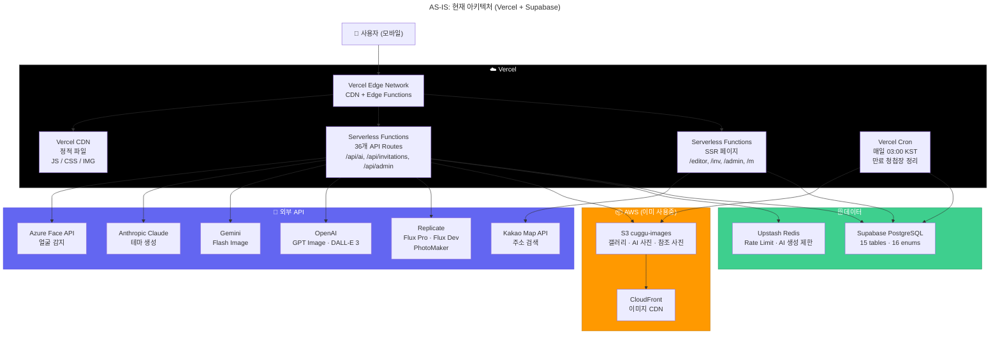
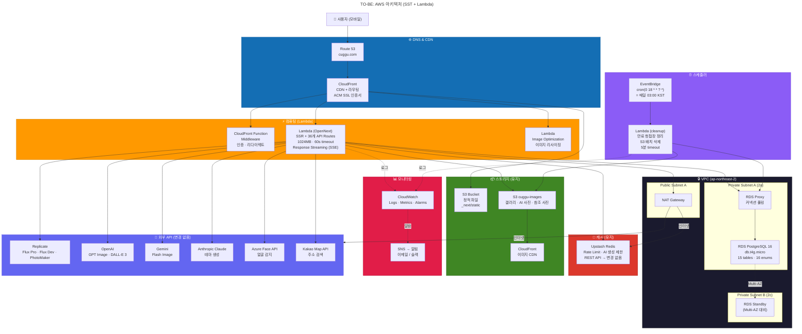
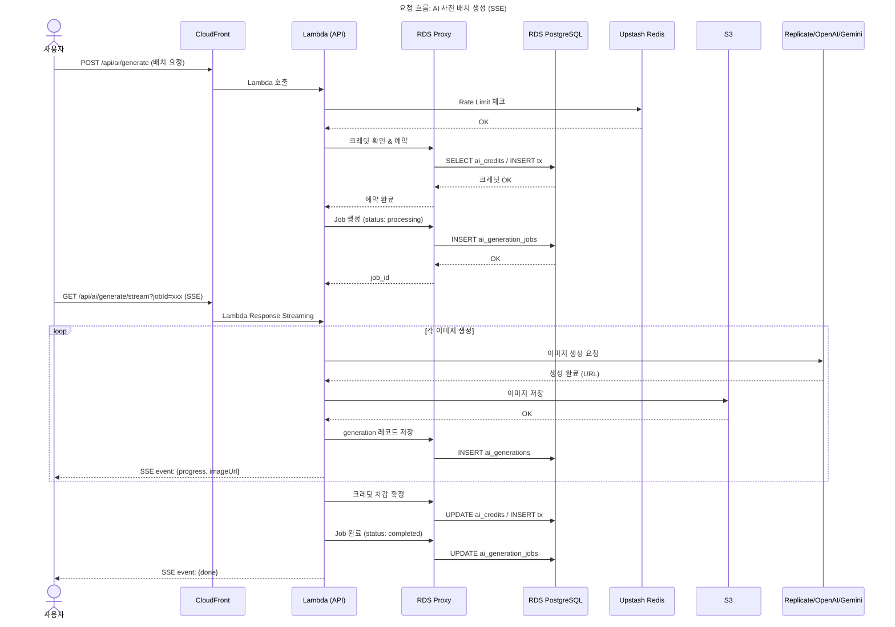
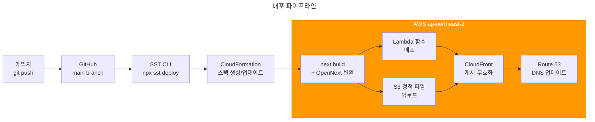

# Cuggu AWS 마이그레이션 아키텍처 다이어그램

> 최종 업데이트: 2026-02-24

---

## 1. AS-IS: 현재 아키텍처 (Vercel + Supabase)



---

## 2. TO-BE: AWS 아키텍처 (SST + Lambda)



---

## 3. 요청 흐름: AI 사진 배치 생성 (SSE)



---

## 4. 배포 파이프라인



---

## 5. 변경 요약

| 구분 | AS-IS | TO-BE | 변경 여부 |
|---|---|---|---|
| 컴퓨팅 | Vercel Serverless | Lambda (OpenNext) | 변경 |
| CDN | Vercel CDN | CloudFront | 변경 |
| DNS | Vercel 자동 | Route 53 + ACM | 변경 |
| DB | Supabase PostgreSQL | RDS PostgreSQL + RDS Proxy | 변경 |
| Cron | Vercel Cron | EventBridge + Lambda | 변경 |
| IaC | 없음 | SST (CloudFormation) | 신규 |
| 모니터링 | Vercel Dashboard | CloudWatch + SNS | 신규 |
| 캐시 | Upstash Redis | Upstash Redis | **유지** |
| 이미지 저장 | S3 + CloudFront | S3 + CloudFront | **유지** |
| 외부 API | 6개 프로바이더 | 6개 프로바이더 | **유지** |
| 앱 코드 | Next.js 16 | Next.js 16 | **유지** |

### 코드 변경 범위

```
신규:  sst.config.ts, functions/cleanup.ts
수정:  lib/ai/s3.ts (IAM Role 전환), .gitignore (.sst/ 추가)
삭제:  vercel.json
유지:  36개 API Routes, 15개 DB tables, 프론트엔드 전체
```
