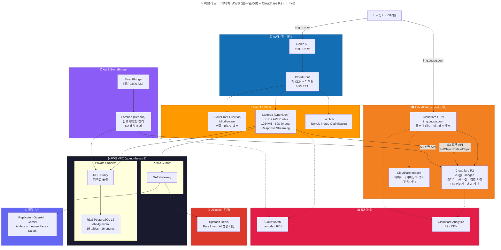
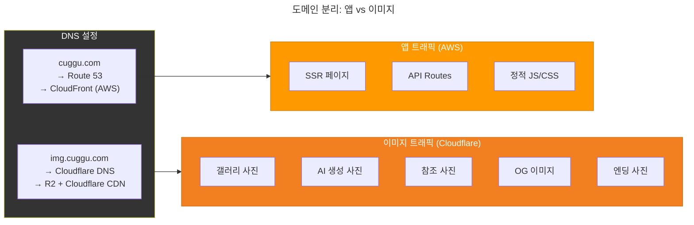
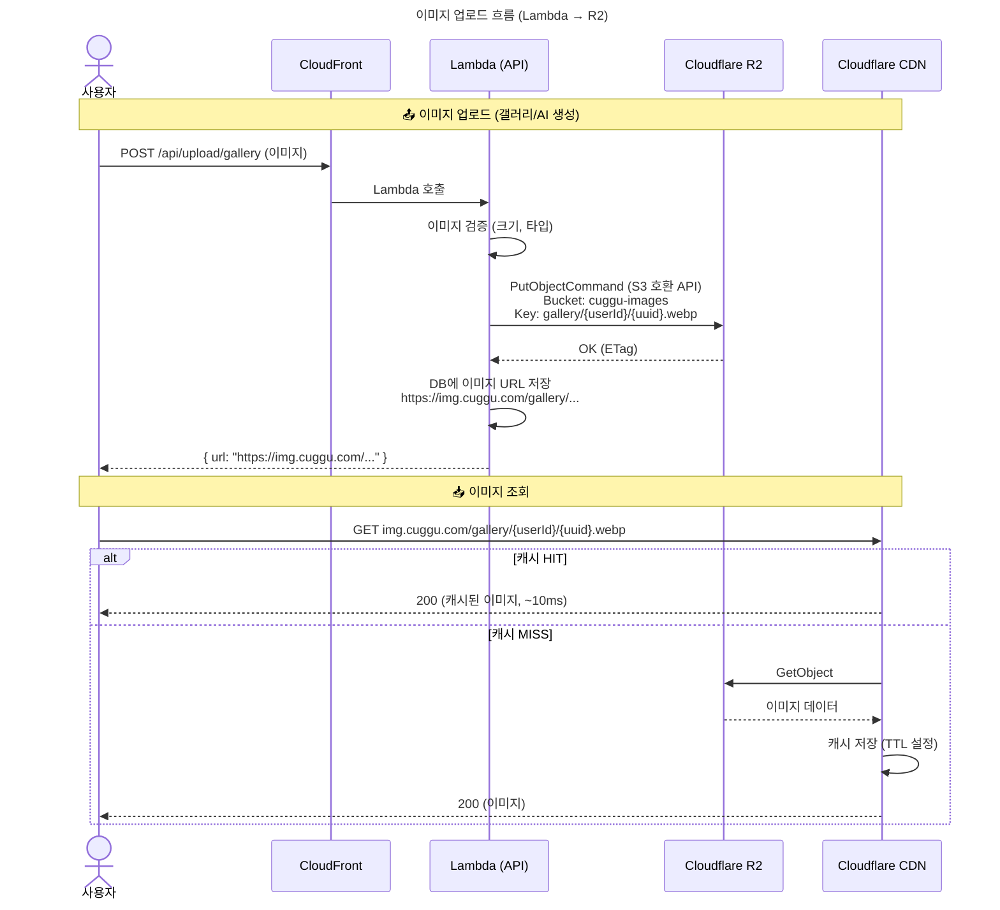
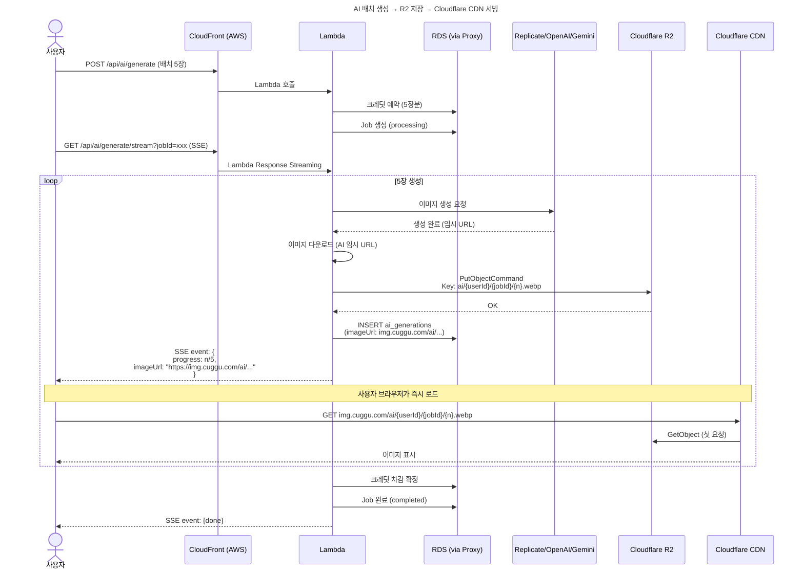
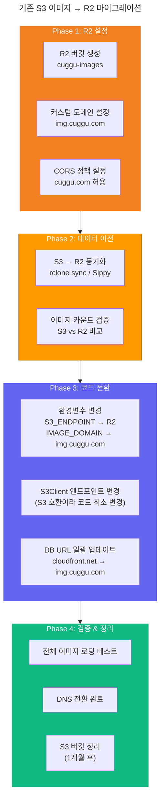
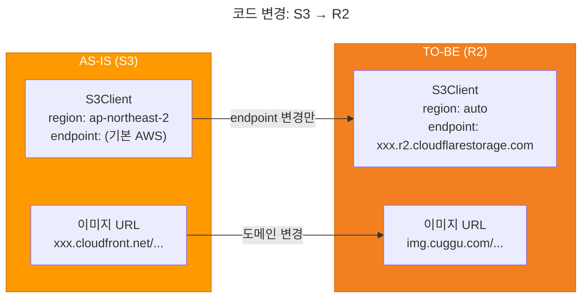
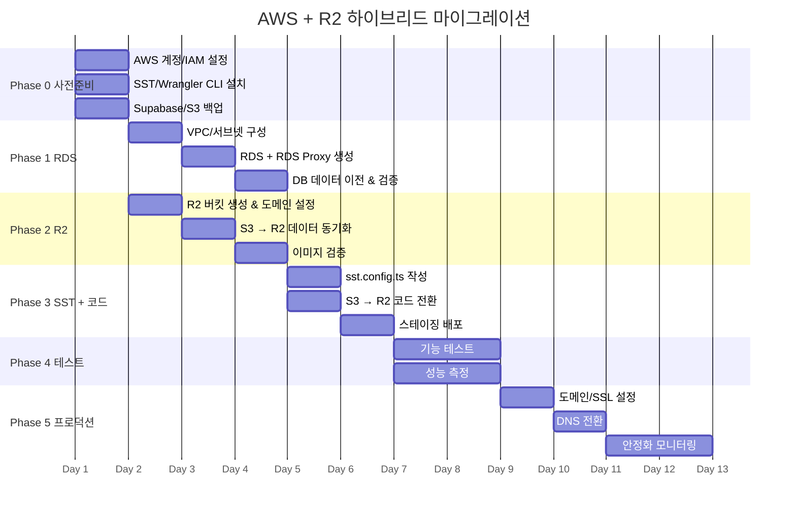

# Cuggu AWS + Cloudflare R2 하이브리드 아키텍처

> 최종 업데이트: 2026-02-24
> 전략: 컴퓨팅/DB는 AWS, 이미지 스토리지는 Cloudflare R2

---

## 왜 하이브리드인가?

```
AWS의 강점          →  컴퓨팅 (Lambda), DB (RDS PostgreSQL), 모니터링 (CloudWatch)
Cloudflare의 강점   →  이그레스 무료 (R2), 글로벌 CDN 기본 포함, Cold Start 없는 엣지

하이브리드 = 각자의 강점만 취합
```

| 항목 | 순수 AWS | 하이브리드 (AWS + R2) | 절감 |
|---|---|---|---|
| 이미지 저장 | S3 $0.023/GB | R2 $0.015/GB | -35% |
| 이미지 이그레스 | CloudFront $0.085~0.12/GB | **$0** | **-100%** |
| CDN (이미지) | CloudFront 별도 과금 | Cloudflare CDN **무료** | **-100%** |
| CDN (앱) | CloudFront (SST 포함) | CloudFront (SST 포함) | 동일 |
| 컴퓨팅/DB | Lambda + RDS | Lambda + RDS | 동일 |

청첩장 서비스는 이미지 서빙이 트래픽의 대부분 → R2 이그레스 무료의 효과가 큼.

---

## 1. 전체 아키텍처



---

## 2. 도메인 & 트래픽 분리



### DNS 설정

```
cuggu.com        → CNAME → xxx.cloudfront.net (AWS)     ← 앱, SSR, API
img.cuggu.com    → CNAME → xxx.r2.dev (Cloudflare)      ← 모든 이미지
```

---

## 3. 이미지 업로드 & 서빙 흐름



---

## 4. AI 사진 배치 생성 (SSE + R2)



---

## 5. S3 → R2 마이그레이션 흐름



---

## 6. 코드 변경 범위

### S3Client → R2 전환 (최소 변경)



### 변경 파일 목록

```
수정 (3~4개):
  ~ lib/ai/s3.ts            → endpoint를 R2로 변경, credentials 방식 변경
  ~ lib/ai/env.ts           → R2_ENDPOINT, R2_ACCESS_KEY_ID 등 추가
  ~ .env.example             → R2 관련 환경변수 추가
  ~ app/api/cron/cleanup     → DeleteObjects가 R2에서도 동일하게 동작

변경 없음:
  - PutObjectCommand, GetObjectCommand, DeleteObjectsCommand → S3 호환이라 그대로
  - 이미지 업로드 로직 전체 (갤러리, AI 생성, 참조 사진, OG)
  - 프론트엔드 이미지 렌더링 (URL 도메인만 환경변수로 처리)

삭제:
  - CloudFront 이미지 배포 (Cloudflare CDN으로 대체)
  - AWS_ACCESS_KEY_ID/SECRET (이미지용, Lambda IAM은 유지)
```

---

## 7. 비용 비교

### 월 예상 비용 (초기, 소량 트래픽)

| 항목 | 순수 AWS | AWS + R2 하이브리드 |
|---|---|---|
| Lambda | $5~20 | $5~20 |
| RDS + Proxy | $25~40 | $25~40 |
| CloudFront (앱) | $1~3 | $1~3 |
| ~~CloudFront (이미지)~~ | ~~$1~5~~ | **$0** (Cloudflare CDN 무료) |
| ~~S3 (스토리지)~~ | ~~$3~5~~ | **$1~3** (R2 저렴) |
| ~~S3 이그레스~~ | ~~$5~15~~ | **$0** (R2 이그레스 무료) |
| Upstash Redis | $0 | $0 |
| Route 53 | $0.50 | $0.50 |
| **합계** | **$41~88** | **$33~67** |
| **이미지 트래픽 증가 시** | **급격히 증가** | **거의 증가 없음** |

### 트래픽 증가 시 (MAU 1만+, 이미지 100GB 서빙/월)

| 항목 | 순수 AWS | AWS + R2 하이브리드 |
|---|---|---|
| 이미지 이그레스 | **$8.5~12** (100GB × $0.085~0.12) | **$0** |
| 이미지 스토리지 (50GB) | $1.15 | $0.75 |
| CDN 요청 | $2~5 | $0 |
| **이미지 관련 소계** | **$12~18** | **$0.75** |

---

## 8. 전체 인프라 매핑

```mermaid
---
title: "서비스별 인프라 매핑"
---
graph TB
    subgraph AWS["☁️ AWS (ap-northeast-2)"]
        direction TB
        AW1["Lambda — SSR + API (36 routes)"]
        AW2["RDS PostgreSQL — 15 tables"]
        AW3["RDS Proxy — 커넥션 풀링"]
        AW4["CloudFront — 앱 CDN (cuggu.com)"]
        AW5["Route 53 — DNS"]
        AW6["EventBridge — Cron"]
        AW7["CloudWatch — 모니터링"]
        AW8["ACM — SSL 인증서"]
    end

    subgraph Cloudflare["🟠 Cloudflare"]
        direction TB
        CF1["R2 — 이미지 스토리지"]
        CF2["CDN — 이미지 서빙 (img.cuggu.com)"]
        CF3["Analytics — R2/CDN 모니터링"]
    end

    subgraph Keep["♻️ 유지"]
        direction TB
        K1["Upstash Redis — Rate Limit"]
        K2["Replicate — AI 생성 (주력)"]
        K3["OpenAI — GPT Image, DALL-E 3"]
        K4["Gemini — Flash Image"]
        K5["Anthropic — 테마 생성"]
        K6["Azure — 얼굴 감지"]
        K7["Kakao — 지도/주소"]
    end

    subgraph Dev["🔧 개발 환경"]
        direction TB
        D1["Vercel — develop 브랜치 배포"]
        D2["Supabase — 개발 DB (유지)"]
    end

    style AWS fill:#FF9900,color:#fff,stroke:#c77a00
    style Cloudflare fill:#F38020,color:#fff,stroke:#d06a10
    style Keep fill:#6366F1,color:#fff,stroke:#4f46e5
    style Dev fill:#000,color:#fff,stroke:#333
```



---

## 9. 마이그레이션 타임라인



---

## 10. 환경변수 (하이브리드 기준)

```
# ── AWS (컴퓨팅/DB) ──
DATABASE_URL=postgresql://...@cuggu-db-proxy.xxx.rds.amazonaws.com:5432/cuggu
AWS_REGION=ap-northeast-2

# ── Cloudflare R2 (이미지) ──
R2_ENDPOINT=https://xxx.r2.cloudflarestorage.com
R2_ACCESS_KEY_ID=xxx
R2_SECRET_ACCESS_KEY=xxx
R2_BUCKET_NAME=cuggu-images
IMAGE_DOMAIN=img.cuggu.com          # 이미지 URL 도메인
# 기존 S3_BUCKET_NAME, CLOUDFRONT_DOMAIN → 제거

# ── Auth ──
NEXTAUTH_URL=https://cuggu.com
NEXTAUTH_SECRET=xxx
KAKAO_CLIENT_ID=xxx
KAKAO_CLIENT_SECRET=xxx

# ── Redis (유지) ──
UPSTASH_REDIS_REST_URL=xxx
UPSTASH_REDIS_REST_TOKEN=xxx

# ── AI (유지) ──
REPLICATE_API_TOKEN=xxx
OPENAI_API_KEY=xxx
GOOGLE_AI_API_KEY=xxx
ANTHROPIC_API_KEY=xxx

# ── Azure (유지) ──
AZURE_FACE_API_KEY=xxx
AZURE_FACE_ENDPOINT=xxx

# ── Encryption (유지) ──
ENCRYPTION_KEY=xxx

# ── Client (유지) ──
NEXT_PUBLIC_KAKAO_MAP_API_KEY=xxx
NEXT_PUBLIC_IMAGE_DOMAIN=img.cuggu.com
```
