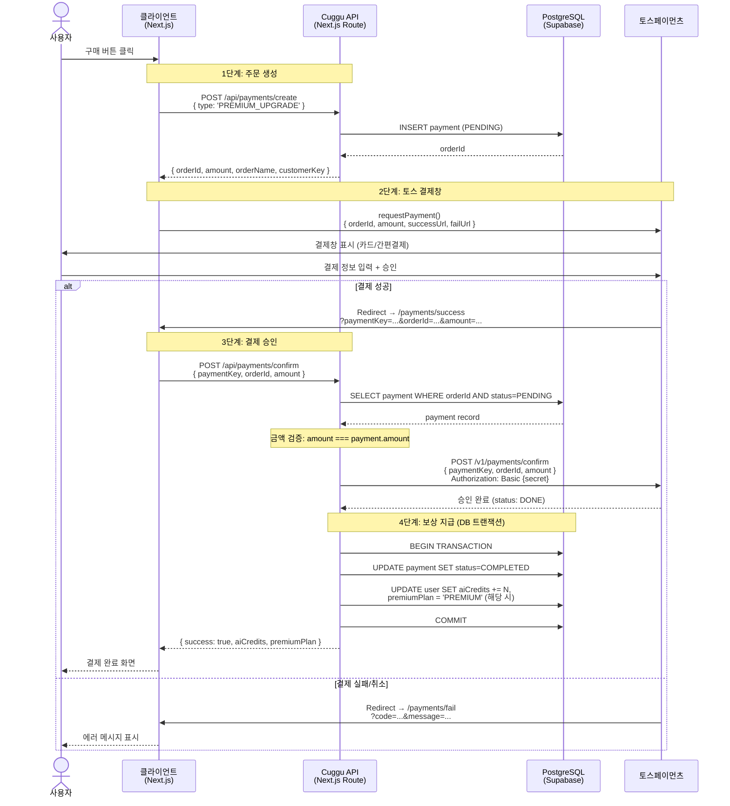
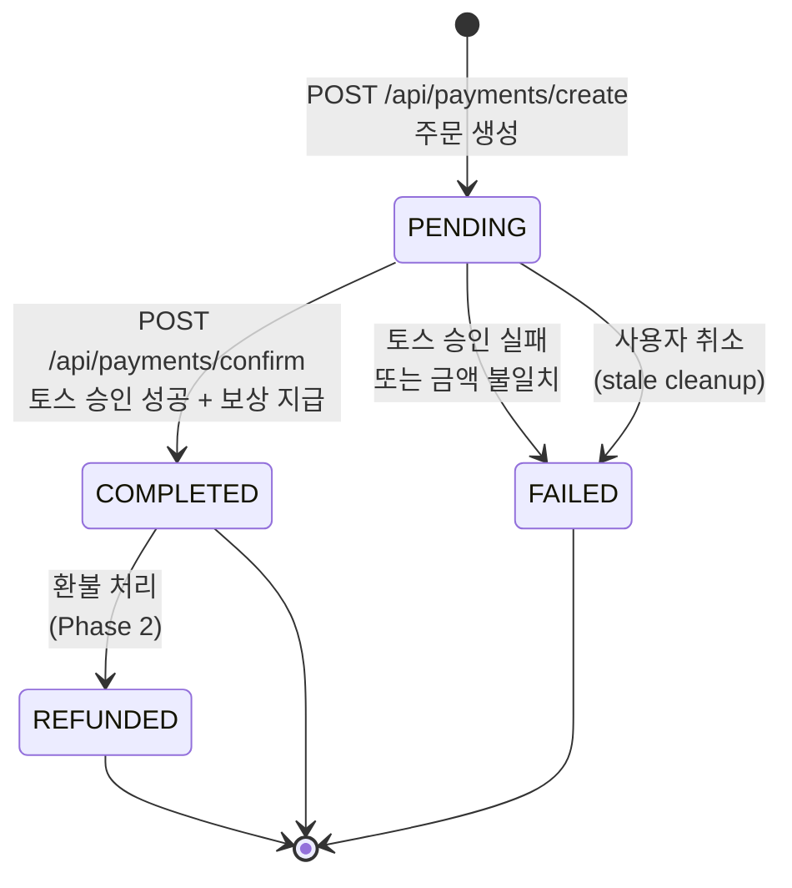
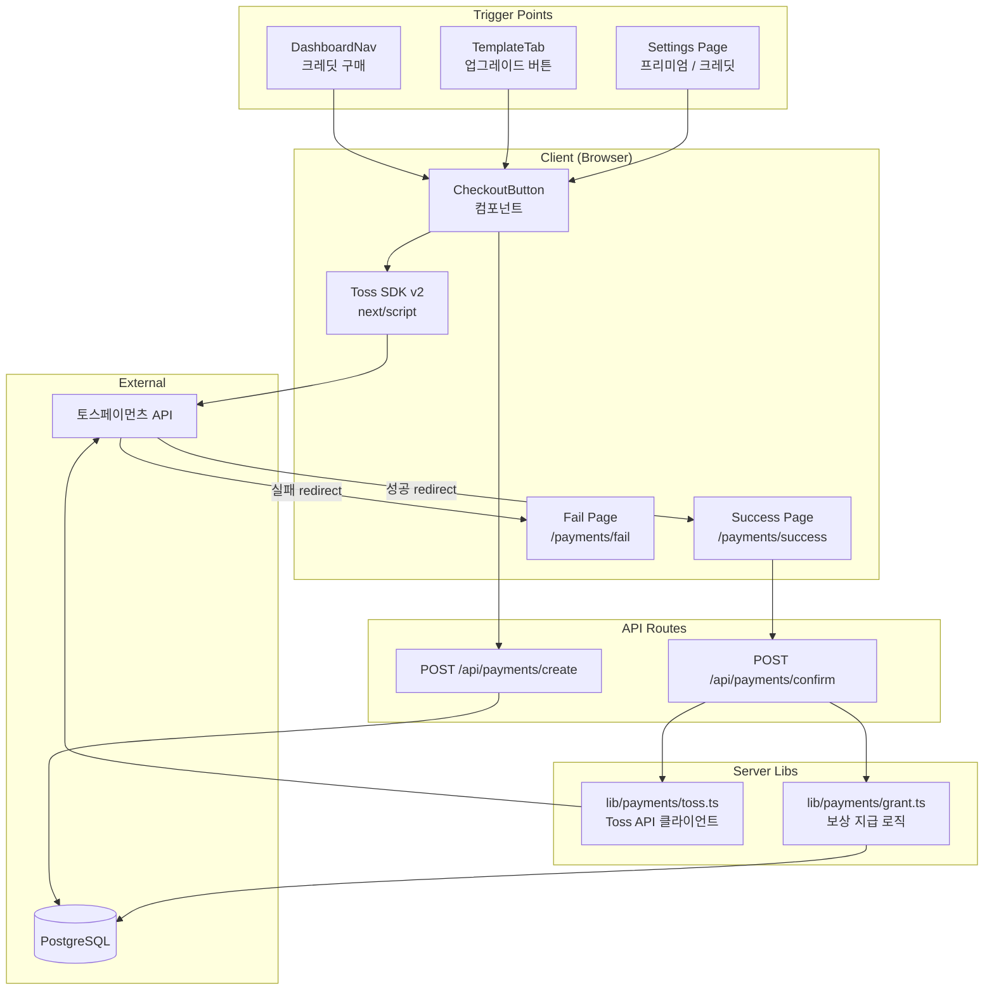

# 토스페이먼츠 결제 시스템 통합 계획

> 프리미엄 업그레이드 + AI 크레딧 구매를 하나의 결제 플로우로 통합
>
> **작성일**: 2026-02-05
> **우선순위**: P0 (MVP 출시 필수)

---

## 1. 목표 & 범위

### 목표
토스페이먼츠 SDK v2를 연동하여 3개 결제 상품을 하나의 통합 플로우로 처리

### 상품 구성

| 상품 | 금액 (KRW) | 보상 | 비고 |
|------|-----------|------|------|
| 프리미엄 업그레이드 | 9,900원 | premiumPlan=PREMIUM + 크레딧 10회 | 일회성 |
| AI 크레딧 1회 | 1,000원 | 크레딧 1회 | 건별 구매 |
| AI 크레딧 10회 패키지 | 8,000원 | 크레딧 10회 | 20% 할인 |

### 범위 (MVP)
- 토스페이먼츠 SDK v2 standard (redirect) 연동
- 결제 생성 / 승인 API
- 성공 / 실패 리다이렉트 페이지
- 기존 UI 버튼 연결 (settings, TemplateTab, DashboardNav)

### 제외 (Phase 2)
- 카카오페이 연동
- Webhook 처리
- 정기결제 (subscription)
- 환불 API
- 관리자 결제 대시보드

---

## 2. 기술 스택

| 구분 | 기술 | 이유 |
|------|------|------|
| 결제 SDK | 토스페이먼츠 SDK v2 (script tag) | 공식 권장, v1 deprecated |
| 서버 인증 | Basic auth (TOSS_SECRET_KEY) | 토스 API 표준 |
| DB | 기존 payments 테이블 (Drizzle ORM) | 스키마 변경 불필요 |
| 검증 | 기존 Zod 스키마 | TossPaymentApprovalResponseSchema 이미 존재 |

---

## 3. 결제 흐름

### 3.1 전체 시퀀스 다이어그램



### 3.2 상태 흐름도



### 3.3 컴포넌트 아키텍처



---

## 4. 파일별 구현 상세

### 4.1 신규 생성 파일 (8개)

#### `lib/payments/toss.ts` — Toss confirm API 클라이언트

```typescript
// 핵심 함수
export async function confirmPayment(params: {
  paymentKey: string;
  orderId: string;
  amount: number;
}): Promise<TossPaymentApprovalResponse>

// 내부 동작:
// - POST https://api.tosspayments.com/v1/payments/confirm
// - Authorization: Basic base64(TOSS_SECRET_KEY + ':')
// - Body: { paymentKey, orderId, amount }
// - 성공: TossPaymentApprovalResponseSchema로 파싱
// - 실패: TossPaymentErrorResponseSchema로 파싱 후 throw
```

**참조**: `schemas/payment.ts:89` (TossPaymentApprovalResponseSchema)

#### `lib/payments/grant.ts` — 보상 지급 (atomic transaction)

```typescript
export async function grantPaymentRewards(
  userId: string,
  paymentId: string,
  paymentType: PaymentType,
  paymentKey: string,
): Promise<void>

// db.transaction() 내부:
// 1. payment 상태 PENDING 재확인 (이중 지급 방지)
// 2. payment → COMPLETED, paymentKey 저장
// 3. 타입별 보상 지급:
//    - PREMIUM_UPGRADE: premiumPlan='PREMIUM' + aiCredits += 10
//    - AI_CREDITS: aiCredits += 1
//    - AI_CREDITS_BUNDLE: aiCredits += 10
// 4. atomic increment: sql`${users.aiCredits} + ${credits}`
```

**참조**: `lib/ai/credits.ts:74` (동일한 atomic increment 패턴)

#### `app/api/payments/create/route.ts` — 주문 생성

```
POST /api/payments/create
Request:  { type: PaymentType }
Response: { orderId, amount, orderName, customerKey }

1. auth() 인증 확인
2. CreatePaymentRequestSchema 검증
3. 이미 프리미엄인데 PREMIUM_UPGRADE → 409 거부
4. PAYMENT_AMOUNTS[type]으로 금액 결정
5. generateOrderId()로 orderId 생성
6. DB에 PENDING 레코드 삽입
7. 응답 반환
```

**참조**: `app/api/payments/history/route.ts` (동일한 인증/쿼리 패턴)

#### `app/api/payments/confirm/route.ts` — 결제 승인

```
POST /api/payments/confirm
Request:  { paymentKey, orderId, amount }
Response: { paymentId, type, premiumPlan, aiCredits }

1. auth() 인증 확인
2. ApprovePaymentRequestSchema 검증
3. orderId + userId + status=PENDING으로 payment 조회
4. ** amount === payment.amount 검증 (변조 방지) **
5. confirmPayment() → Toss API 호출
6. 성공: grantPaymentRewards() 트랜잭션
7. 실패: payment 상태 FAILED 업데이트
```

#### `app/payments/layout.tsx` — 결제 페이지 레이아웃

- DashboardNav 없이 심플한 중앙 정렬
- gradient 배경

#### `app/payments/success/page.tsx` — 성공 리다이렉트

```
'use client'
- useSearchParams()로 paymentKey, orderId, amount 추출
- useEffect → POST /api/payments/confirm
- 상태: loading | success | error
- 성공 시 결제 결과 + "대시보드로 이동" 버튼
```

#### `app/payments/fail/page.tsx` — 실패 페이지

```
'use client'
- useSearchParams()로 code, message 추출
- 에러 메시지 표시
- "다시 시도" + "문의하기" 버튼
```

#### `components/payments/CheckoutButton.tsx` — 재사용 결제 버튼

```typescript
interface CheckoutButtonProps {
  paymentType: PaymentType;  // 'PREMIUM_UPGRADE' | 'AI_CREDITS' | 'AI_CREDITS_BUNDLE'
  children: React.ReactNode;
  className?: string;
  disabled?: boolean;
}

// 동작:
// 1. next/script로 Toss SDK lazyOnload
// 2. 클릭 → POST /api/payments/create
// 3. TossPayments(clientKey).payment({ customerKey })
// 4. requestPayment({ method: 'CARD', amount, orderId, successUrl, failUrl })
```

### 4.2 수정 파일 (5개)

| 파일 | 변경 내용 |
|------|-----------|
| `schemas/payment.ts` | `ORDER_NAMES` 상수 추가 |
| `app/dashboard/settings/page.tsx` | 프리미엄/크레딧 버튼 → CheckoutButton 교체 |
| `components/editor/tabs/TemplateTab.tsx` | 업그레이드 버튼 → CheckoutButton 교체 |
| `components/layout/DashboardNav.tsx` | 크레딧 구매 버튼 → CheckoutButton 교체 |
| `.env.example` | `NEXT_PUBLIC_TOSS_CLIENT_KEY` 추가 |

---

## 5. 핵심 설계 결정

| # | 결정 | 선택 | 이유 |
|---|------|------|------|
| 1 | SDK 방식 | v2 standard (redirect) | v1 deprecated, 고정가 3개 상품에 widget 불필요 |
| 2 | SDK 로딩 | next/script lazyOnload | npm 패키지 없음, 클릭 시에만 필요 |
| 3 | 서버 확인 순서 | Toss API 먼저 → DB 트랜잭션 | 외부 호출 중 DB 커넥션 점유 방지 |
| 4 | customerKey | user.id (cuid2) | 고유+안정적, 토스 저장카드 기능 활용 가능 |
| 5 | Webhook | MVP 생략 | 동기 confirm 플로우로 충분 |
| 6 | 이중 지급 방지 | PENDING 필터 + 트랜잭션 내 재확인 | 2중 안전장치 |

---

## 6. 보안

| 위협 | 대응 |
|------|------|
| 클라이언트 금액 변조 | confirm 시 DB의 PENDING 금액과 비교, 불일치 시 거부 |
| 이중 지급 | status=PENDING 조건 조회 + 트랜잭션 내 재확인 |
| Secret key 노출 | `TOSS_SECRET_KEY`는 서버 전용, NEXT_PUBLIC_ 접두사 없음 |
| 위조 confirm 요청 | 인증 필수 + orderId 소유권 확인 + 토스 자체 검증 |
| Stale PENDING 레코드 | Phase 2에서 cron cleanup (MVP에서는 무해) |

---

## 7. 환경변수

```env
# 기존
TOSS_CLIENT_KEY=""        # 서버에서도 참조 가능
TOSS_SECRET_KEY=""        # 서버 전용 (절대 클라이언트 노출 금지)

# 신규
NEXT_PUBLIC_TOSS_CLIENT_KEY=""   # 브라우저에서 SDK 초기화용 (공개 키)
```

> 테스트 키: `test_ck_*` / `test_sk_*` (토스 개발자센터에서 발급)

---

## 8. 구현 순서

```
1. lib/payments/toss.ts + grant.ts     (서버 유틸)
2. schemas/payment.ts 수정              (ORDER_NAMES 추가)
3. app/api/payments/create + confirm    (API 라우트)
4. app/payments/ layout + success + fail (리다이렉트 페이지)
5. components/payments/CheckoutButton   (클라이언트 컴포넌트)
6. 기존 버튼 연결                        (settings, TemplateTab, DashboardNav)
7. .env.example 업데이트
```

---

## 9. 검증 방법

1. **테스트 키 결제**: 토스 테스트 키로 전체 플로우 (생성 → 결제 → 승인 → 보상)
2. **3개 상품 각각**: PREMIUM_UPGRADE, AI_CREDITS, AI_CREDITS_BUNDLE
3. **이중 지급 방지**: 같은 orderId로 confirm 2회 → 두 번째 409
4. **금액 변조**: success URL amount 파라미터 변경 → 400
5. **결제 실패**: 토스 테스트 실패 시나리오 → fail 페이지
6. **크레딧 확인**: 결제 후 settings에서 잔액 증가 확인
7. **프리미엄 전환**: PREMIUM_UPGRADE 후 기능 해금 확인

---

## 10. 참고 자료

- [토스페이먼츠 SDK v2 문서](https://docs.tosspayments.com/sdk/v2/js)
- [결제위젯 연동 가이드](https://docs.tosspayments.com/guides/payment-widget/integration)
- [GitHub 샘플](https://github.com/tosspayments/tosspayments-sample-v1)

---

## 11. 절대 건드리면 안 되는 부분

- `db/schema.ts` payments 테이블 — 이미 완벽, 마이그레이션 불필요
- `lib/ai/credits.ts` — 기존 크레딧 로직 유지, grant.ts에서 같은 패턴만 참조
- `schemas/payment.ts` 기존 스키마 — 추가만, 변경 없음

## 12. 바꿔도 되는 부분

- CheckoutButton 내부 UX (로딩 스피너, 에러 처리)
- success/fail 페이지 디자인
- 결제 방법 (CARD 고정 → 추후 간편결제 추가 가능)
- ORDER_NAMES 문구
